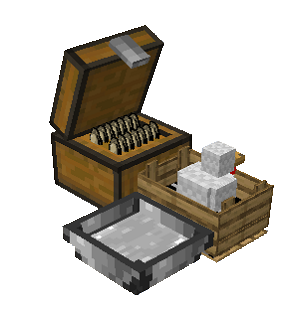
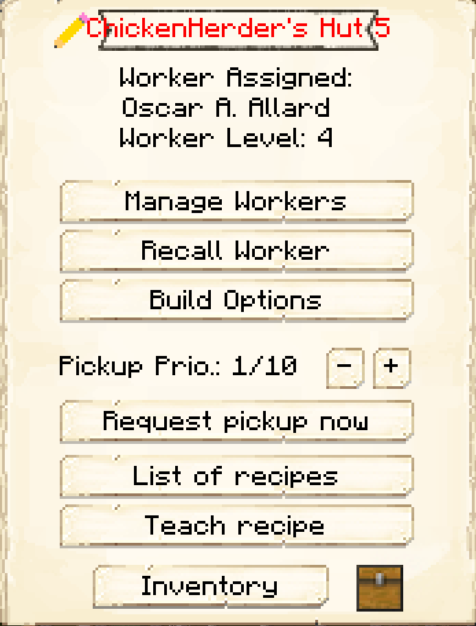

# Chicken Herder's Hut

    
    

    

        

        
<strong>Worker:</strong> <a href="../workers/chickenherder">Chicken Herder</a>

        

    

    

    

        

        
<strong>Recipe:</strong> 
        

    

    <recipe>chickenherder</recipe>
    

# About the Building

 The ChickenHerder Hut is where the chickenherder will raise chickens, collect eggs, and butcher chickens for food. You will have to capture and bring in 2 Chickens to the herder's hut. The herder will not catch and bring in any Chickens.

**Note:** The Herder will only keep alive 2 Chickens per hut level, so at level 5 they will have 10 Chickens in their holding pens alive to breed and butcher. This means they will keep *MORE* and have faster production and collection of meats, drops and by products. So:

| Building Level | Chickens "Housed" |
| ----- | ----- |
| 1 | 2 |
| 2 | 4 |
| 3 | 6 |
| 4 | 8 |
| 5 | 10 |  

# ChickenHerder's Hut GUI

Now you can access the Chicken's Hut block (right click on it) and you will see a GUI with different options:

 

  

    
  

  

    
The Worker assigned and it's Level. (The worker levels up in time by doing it's work. The higher the level the faster and more efficient they will be). And the buttons:

    <ul> 
      
        <li><strong>{{ item.button }}:</strong> {{ item.content }}</li>
      
    </ul>
  

  
   
  
### **To see build options please see the [Builder](../../source/workers/builder) Page**  
