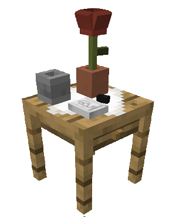
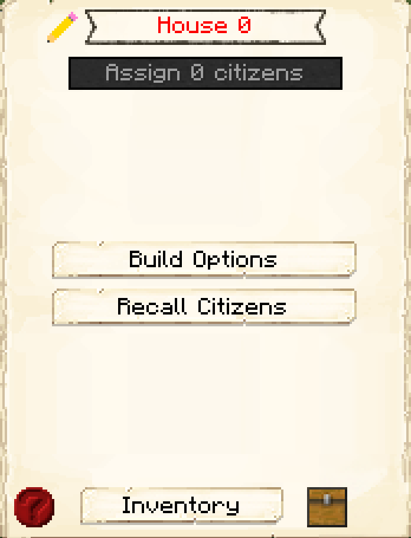

# Citizen's Hut

    
    <recipe>citizen</recipe>

# About the Citizen's Hut

The Citizen's Hut is a house for your citizens. They will go to the Citizen's Hut they are assigned to at night to sleep. It's also the only way to get more citizens for your colony.

Each level of the Citizen's Hut will house one citizen. So: 

| Building Level | Citizens Housed |
| ----- | ----- |
| 1 | 1 |
| 2 | 2 |
| 3 | 3 |
| 4 | 4 |
| 5 | 5 |

 

For additional citizens to spawn, you first have to have enough space in your Citizen's Hut(s) to house your first four citizens. After you have created enough space for your initial four citizens, you have two options for your colony to grow. The first way is to have at least one Citizen's Hut at least level 2 that houses a male and a female citizen, which will allow a child to be born in the colony when there is room. You can also make space for a new citizen, go to the [Town Hall](../../source/buildings/townhall), and then use the Recruitment option to hire a new citizen who will show up immediately.  
 

# Citizen's Hut GUI

When accessing the Citizen's Hut block by right-clicking on it, you will see a GUI with different options:

 

  

    
  

  

     
    <ul>
      
        <li><strong>{{ item.button }}:</strong> {{ item.content }}</li>
      
    </ul>
  

  
   
  
