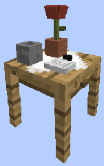
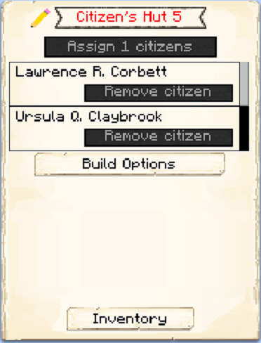

# Citizen Hut

    
    

    <recipe>citizen</recipe>

The Citizen Hut is the *BEST* way for you to get more Citizen's for your Town. After you have crafted the Citizen Hut block, use your [Building Tool](../items/buildingtool) to place the building. 

The building will virtually house your Citizens. Each level of the Citizen Hut will "house" 1 Citizen. So: 

| Building Level | Citizens "Housed" |
| ----- | ----- |
| 1 | 1 |
| 2 | 2 |
| 3 | 3 |
| 4 | 4 |
| 5 | 5 |

  
- **Note:** For additional Citizens to spawn, you first have to have enough space in your Citizen Hut(s) to "house" your first 4 Citizens.

- **For example:** 

1 Citizen Hut level 4 = 4 Citizens... or 
2 Citizen Huts level 2 = 4 Citizens... or 
1 Citizen Hut level 1 and 1 Citizen Hut level 3 = 4 Citizens... or even 
4 Citizen Huts all level 1 = 4 Citizens.

You can build/upgrade as you like, as long as the total building level equals 4. That will "house" your initial 4 Citizens, in any combination you want. Awesome, right?

After you have created enough space for your 4 initial Citizens, to get a new citizen to spawn 1 of 2 things must happen. 
  * Option 1: Children - To get children to spawn, a male and female must be housed in 1 hut and there must be a free bed in the colony. It doesn't have to be in the same house as the male and female. If the free bed is in the same house as the "parents" the child will take the surname of the "mother". If the free bed is in the hut where someone else lives, they will take the surname of the person already housed in that citizen hut. If the free bed is in a house where no one lives, then they will get a random surname. 
  * Option 2: Recruitment - You can recruit new citizens through the [TownHall](../source/buildings/townhall), On the Actions page.  
  

## Hut GUI

When accessing the Citizen's Hut block (right clicking on it) you will see a GUI with different options:

 

  

    
  

  

     
    
 This is the GUI for the Citizen's Hut. It shows the build "level" of the Hut. And the buttons:

   <ul>
      
        <li><strong>{{ item.button }}:</strong> {{ item.content }}</li>
      
    </ul>
  

  
   
  
### **To see build options please see the [Builder](../../source/workers/builder) Page**  
