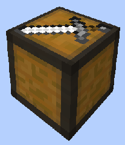

# Combat Academy

    
    

    

        

        
<strong>Worker:</strong>

        

        

        
<a href="../workers/guard">Guard</a>

        

    

    

    <recipe>combatacademy</recipe>

The Combat Academy building is where you train your knights to level up without risk of dying to mobs. The number of students depend on the level of the building. 

| Combat Academy Level | Max # of Students |
| :----: | :----: |
| 1 | 1 |
| 2 | 2 |
| 3 | 3 |
| 4 | 4 |
| 5 | 5 |

The students require a sword and shield to practice. They will stand near the practice dummy, a pumpkin ontop of a bail of hay. 

The students of the Combat Academy are not actual guards even though they will be dressed as guards, it the usual knight clothes. They will go to their own house at night to sleep. 

Before you choose a place to build the Combat Academy, take into account the distance you want it from the other "military" buildings, while it isn't required to be near the barracks or archery, you may want to have a "military complex" area.

After you have selected a place for the Combat Academy building you have to craft the Combat Academy block in the crafting table and use your [Building Tool](../items/buildingtool) to place the building. Once you commit to the placement of the Combat Academy hut, the block will be placed.

You now officially have a Combat Academy Hut, **CONGRATULATIONS!**

Now you will have to issue the builder the “Build” assignment so it can build the “Combat Academy”. It will be asking for the materials it needs. Make sure to check the “chat” regularly to see what materials the builder is requesting for any build/upgrade.

**Hint:** If you see the [Builder](../../source/workers/builder) has not finished building/upgrading your Combat Academy and you don’t see the builder asking for any materials, go to the builder’s hut and “recall” the builder and wait a bit to see what the builder needs. Watch the Minecraft “chat” section. Also you can go to page 2 of the builder’s hut GUI and check the list of materials required, any material in the list that is still missing will be in red colored letters.  

Now you can access the Combat Academy block (right click on it) and you will see a GUI with different options:  

  

    
   

  

    
The Worker assigned and it's Level. (The worker levels up in time by doing it's work. The higher the level the faster and more efficient it will be). And the buttons:

    <ul>
      
        <li><strong>{{ item.button }}:</strong> {{ item.content }}</li>
      
    </ul>
  

  
   
  
### **To see build options please see the [Builder](../../source/workers/builder) Page**  
