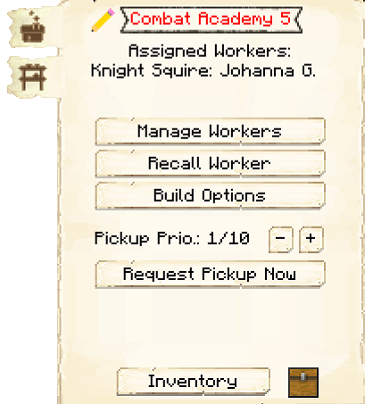

# Combat Academy

    
    

    

        

        
<strong>Worker:</strong>

        

        

        
<a href="../workers/knight">Knight in Training</a>

        

    

    

    <recipe>combatacademy</recipe>

# About the Combat Academy

The Combat Academy is where your [Knights in Training](../../source/workers/knight) will train to become [Knight Guards](../../source/workers/guard). This also allows them to level up without a risk of dying to mobs. The number of students that can be trained at a time depends on the level of the Academy. 

| Combat Academy Level | Max # of Students |
| :----: | :----: |
| 1 | 1 |
| 2 | 2 |
| 3 | 3 |
| 4 | 4 |
| 5 | 5 |

The Knights in Training require a sword and shield to practice. They will stand near the practice dummy, a pumpkin on top of a bail of hay. 

The Knights in Training are not actual Guards even though they will be dressed as Knight Guards. They will go to their own house at night to sleep.

# Combat Academy GUI

When accessing the Combat Academy's hut block by right-clicking on it, you will see a GUI with different options:

 

  

    
   

  

     
    <ul>
      
        <li><strong>{{ item.button }}:</strong> {{ item.content }}</li>
      
    </ul>
  

  
    
