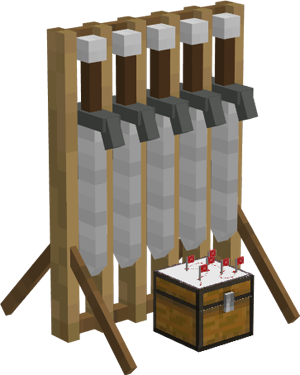

# Combat Academy

    
    

    

        

        
<strong>Worker:</strong>

        

        

        
<a href="../workers/knight">Knight in Training</a>

        

    

    

    <recipe>combatacademy</recipe>

## About the Building

The Combat Academy building is where your [Knights in Training](../../source/workers/knight) become [Knight Guards](../../source/workers/guard). This also allows them to level up without risk of dying to mobs. The number of students depend on the level of the building. 

| Combat Academy Level | Max # of Students |
| :----: | :----: |
| 1 | 1 |
| 2 | 2 |
| 3 | 3 |
| 4 | 4 |
| 5 | 5 |

The Knights in Training require a sword and shield to practice. They will stand near the practice dummy, a pumpkin ontop of a bail of hay. 

The Knights in Training are not actual guards even though they will be dressed as guards, in the usual Knights clothes. They will go to their own house at night to sleep.  

## Combat Academy's GUI

Now you can access the Combat Academy block (right click on it) and you will see a GUI with different options:

 

  

    
   

  

    
The Worker assigned and it's Level. (The worker levels up in time by doing it's work. The higher the level the faster and more efficient it will be). And the buttons:

    <ul>
      
        <li><strong>{{ item.button }}:</strong> {{ item.content }}</li>
      
    </ul>
  

  
   
  
### **To see build options please see the [Builder](../../source/workers/builder) Page**  
