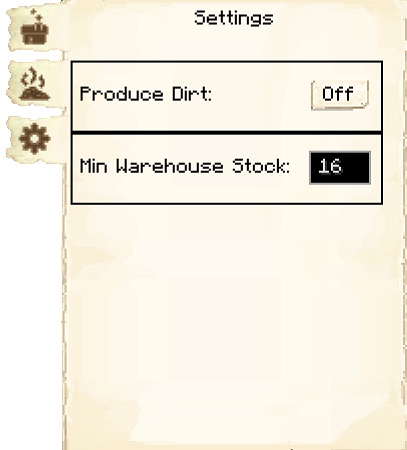

# Composter's Hut

    
    

    

        

        
<strong>Worker:</strong>

        

        

        
<a href="../workers/composter">Composter</a>

        

    

    

    <recipe>composter</recipe>

### Note: The Composter's Hut cannot be built until you have a level 3 [Farm](../../source/buildings/farm&field) (or three level 1 Farms, or another equivalent) and have finished the research in the [University](../../source/buildings/university).
  

The Composter's Hut is where the Composter will turn organic materials into [compost](../../source/items/compost), which can be used by the [Farmer](../../source/workers/farmer) or [Florist](../../source/workers/florist) to fertilize crops or flowers. They can also create dirt if you have the setting enabled, which the [Builder](../../source/workers/builder) can use in buildings. The Composter uses [compost barrels](../../source/items/compostbarrel) to make compost or dirt.

**Hint:** The higher the level of the Composter's Hut, the more compost barrels the Composter will be able to use. So:

| Building Level | Compost Barrels |
| :-----: | :-----: |
| 1 | 1 |
| 2 | 2 |
| 3 | 3 |
| 4 | 4 |
| 5 | 5 |

## Composter's Hut GUI

When accessing the Composter's Hut block by right-clicking on it, you will see a GUI with different options.   You start on the main tab:

 

  

    
  

  

      
     <ul>
      
        <li><strong>{{ item.button }}:</strong> {{ item.content }}</li>
      
     </ul>
  

 

    

      
    

    

    
The second tab of the GUI is <strong>Items to Compost</strong>.

        <ul>
          <li><strong>Items to compost:</strong> Here you will see a list of all the items that were recognized for the composter to use, including modded items. All items are off by default. You can then select which items you want the composter to use by clicking on the button. The black box at the top lets you search for items.</li>
          <li><strong>Reset to Default:</strong> Resets all items to off.</li>
        </ul>
    

 

    

      
    

    

    
The third tab of the GUI is <strong>Settings</strong>.

        <ul>
          <li><strong>Produce Dirt:</strong> Turning this on will make dirt instead of compost.  It also occassionally produces podzol.</li>
          <li><strong>Min Warehouse Stock:</strong> This is the minimum number of an item to be left in the warehouse before the hut will request and compost other items.  The default is 16.</li>
        </ul>
    

