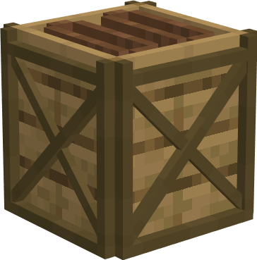
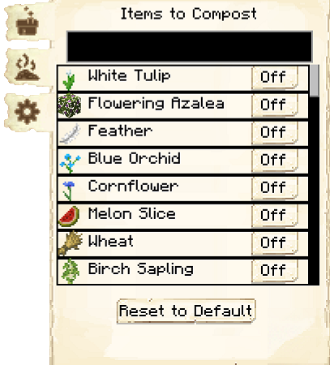

# Composter's Hut

    
    

    

        

        
<strong>Worker:</strong>

        

        

        
<a href="../workers/composter">Composter</a>

        

    

    

    <recipe>composter</recipe>

# About the Composter's Hut

The Composter's Hut is where the Composter will turn extra organic materials into [compost](../../source/items/compost), which can be used by the [Farmer](../../source/worker/farmer) or [Florist](../../source/worker/florist) to fertilize food or flowers. They can also create dirt if you have the setting enabled, which the [Builder](../../source/worker/builder) can use in buildings. The Composter uses [barrels](../../source/items/barrel) to make compost or dirt.

**Hint:** The higher the level of the Composter's Hut, the more barrels the Composter will be able to use. So:

| Building Level | Barrels |
| :-----: | :-----: |
| 1 | 1 |
| 2 | 2 |
| 3 | 3 |
| 4 | 4 |
| 5 | 5 |

# Composter's Hut GUI

When accessing the Composter's Hut block by right-clicking on it, you will see a GUI with different options:

 

  

    
  

  

       
    <ul>
      <li><strong>Composter Hut 5:</strong> This tells you the building you have selected is a Composter's Hut with build level 5.</li>
      <li><strong>Worker Assigned:</strong> Tells you the worker assigned to the Composter's Hut and their worker level. The worker levels up in time by working. The higher the level, the faster and more efficient they will be.</li>
          <li><strong>Manage Workers:</strong> Lets you change which worker is assigned to be the Composter. There can only be one Composter at a time. <b>Note:</b> this only works if you have turned the worker hiring mode in the [Town Hall](../../source/buildings/townhall) block to manual, otherwise your citizens will be hired automatically.</li>
      <li><strong>Recall Worker:</strong> Recalls the Composter to their hut block. You might use it if they are stuck somewhere, you want to see what they have, or want to give them something directly.</li>
      <li><strong>Build Options:</strong> Lets you create a build, upgrade, reposition, or repair build order for the Composter's Hut. To learn more about the building system, please visit the [Builder](../../source/workers/builder) page.</li>
      <li><strong>Delivery Priority:</strong> You can set the priority that a [deliveryman](../../source/workers/deliveryman) will deliver requested materials and take compost or dirt to the [warehouse](../../source/buildings/warehouse) (ten is the highest, one is the lowest). You can also set whether it is automatic, meaning it changes automatically based on if the Composter has any requests (among other factors), or static, meaning it stays to what you set it no matter what.</li>
      <li><strong>List of Recipes and Teach Recipe:</strong> When clicking the list of recipes button, you see all the recipes you have taught this Composter's Hut and can remove them. When clicking teach recipe, it opens a 3x3 crafting grid which allows you to teach this hut recipes (not the worker). <b>Note:</b> you don't need to teach the Composter's Hut any recipes for the Composter to do their job.</li>
      <li><strong>Inventory:</strong> Here you can access the hut block's storage, where the Composter takes their materials and deposits their compost or dirt. They will also use any [racks](../../source/decoblocks/rack) or chests in the hut, so be sure to check those as well!</li>
    </ul>
  

By pressing the arrow button in the top right corner of the GUI, you will be taken to page two of the GUI.

  

    
  

  

    <ul> 
      <li><strong>Items to compost:</strong> Here you will see a list of all the items that were recognized for the composter to use, including modded items. All items are off by default. You can then select which items you want the composter to use by clicking on the button. (The black box at the top lets you search for items.)</li> 
     <li><strong>Compost/Dirt:</strong> You can select which item you want the composter to make, compost or dirt. Just click on the button to change the setting.</li>
    </ul>
  

   
   
