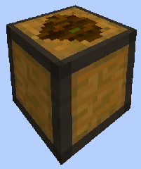
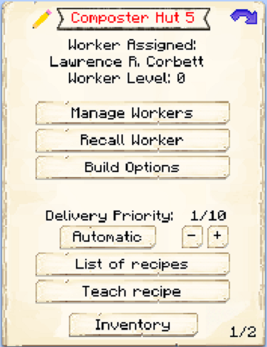
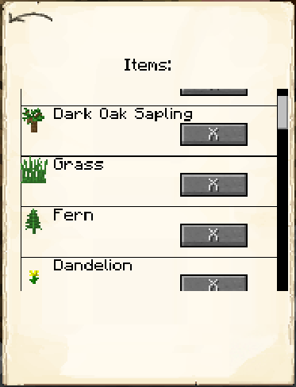

# Composter's Hut

    
    

    

        

        
<strong>Worker:</strong>

        

        

        
<a href="../workers/composter">Composter</a>

        

    

    

    <recipe>composter</recipe>

Welcome to the Composter’s Information Site.

Before you choose a place to build it's Hut, take into account the distances among the other buildings and obstacles like water, trees, caves, mountains, lava sources, etc. After you have selected a place for the Hut, you have to craft the Composter's Hut block and place it with your [Building Tool](../items/buildingtool). Once the hut is placed, the Composter will be automatically assigned (or you can manually assign one with the best  [Traits](../systems/workerinfo) for Composter if you changed this in the setting tab in the [Town Hall's GUI](../../source/buildings/townhall).

Now you will have to issue the “Build” assignment so it can build the "composter Hut".  Once the builder is done you can now hire the Composter.

**Note:** Once the builder is done you will have to go to page 2 of the hut GUI and "define a list of items to be composted". All recognized items (even modded items) will be listed there. You will have to select from that list what you want the composter to use to make compost or dirt.

**Hint:** You will want to upgrade the Composter to get all the awesome perks it has to offer for higher levels. The higher the level of the Hut the more Barrels the Composter will be able to use. So:

| Building Level | Barrel(s) |
| :-----: | :-----: |
| 1 | 1 |
| 2 | 2 |
| 3 | 3 |
| 4 | 4 |
| 5 | 5 |

## Hut GUI

When accessing the Composter's Hut block (right clicking on it), you will see a GUI with different options:

 

  

    
  

  

    
The Worker assigned and it's Level. (The worker levels up in time by working. The higher the level the faster and more efficient it will be). And the buttons:

    <ul>
      
        <li><strong>{{ item.button }}:</strong> {{ item.content }}</li>
      
    </ul>
  

 

By pressing the arrow button in the top right corner of the GUI, you will be taken to page 2 of the GUI where you will find the following:

 

  

    
  

  

    <ul>    
      <li><strong>Items to compost:</strong> Here you will see a list of all the items that were recognized by the mod for the composter to use. Including modded items. All items are "deselected" (off) by default. You can then select which items you want the composter to use. </li> 
     <li><strong>Compost/Dirt:</strong> You can select which items you want the composter to make; Compost or Dirt. </li>
    </ul>
  

   
   
  
### **To see build options please see the [Builder](../../source/workers/builder) Page**  
