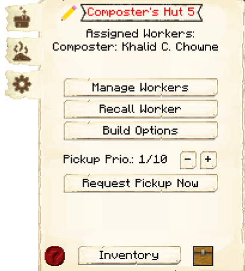

# Composter's Hut

    
    

    

        

        
<strong>Worker:</strong> <a href="../workers/composter">Composter</a>

        

    

    

    

        

        
<strong>Recipe:</strong> 
        

    

    <recipe>composter</recipe>

# About the Building

The composter is used to compost extra organic materials in order to create compost or dirt, which can be used by the [Farmer](../../source/worker/farmer) or [Florist](../../source/worker/florist) or [Builder](../../source/worker/builder) in order to grow food or flowers or for building. 

**Hint:** You will want to upgrade the Composter to get all the awesome perks it has to offer for higher levels. The higher the level of the Hut the more Barrels the Composter will be able to use. So:

| Building Level | Barrel(s) |
| :-----: | :-----: |
| 1 | 1 |
| 2 | 2 |
| 3 | 3 |
| 4 | 4 |
| 5 | 5 |

# Composter Hut GUI

When accessing the Composter's Hut block (right clicking on it), you will see a GUI with different options:

 

  

    
  

  

    
The Worker assigned and it's Level. (The worker levels up in time by working. The higher the level the faster and more efficient it will be). And the buttons:

    <ul>
      
        <li><strong>{{ item.button }}:</strong> {{ item.content }}</li>
      
    </ul>
  

By pressing the arrow button in the top right corner of the GUI, you will be taken to page 2 of the GUI. All recognized items (even modded items) will be listed there. You will have to select from that list what you want the composter to use to make compost or dirt.:

  

    
  

  

    <ul> 
      <li><strong>Items to compost:</strong> Here you will see a list of all the items that were recognized by the mod for the composter to use. Including modded items. All items are "deselected" (off) by default. You can then select which items you want the composter to use. </li> 
     <li><strong>Compost/Dirt:</strong> You can select which items you want the composter to make; Compost or Dirt. </li>
    </ul>
  

   
   
  
### **To see build options please see the [Builder](../../source/workers/builder) Page**  
