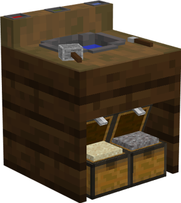

# Concrete Mixer

    
    

    

        

        
<strong>Worker:</strong>

        

        

        
<a href="../workers/concretemixer">Concrete Mixer</a>

        

    

    

    <recipe>concretemixer</recipe>

### Note: The Concrete Mixer's Hut cannot be built until you have a level 1 [Crusher's Hut](../../source/buildings/crusher) and have finished the [research](../../source/systems/research) in the [University](../../source/buildings/university).
 

The Concrete Mixer will craft all types of concrete powder and place them in flowing water (built in to their hut), then mine the resulting concrete. The Concrete Mixer will only make concrete and concrete powder when they receive a request for a block and have the needed materials. (All their recipes are pretaught.)

## Concrete Mixer's Hut GUI

When accessing the Concrete Mixer's Hut by right-clicking on it, you will see a GUI with different options:

 

  

    
  

  

     
    <ul>
      
        <li><strong>{{ item.button }}:</strong> {{ item.content }}</li>
      
    </ul>
  

  
   
  
The 2nd page of the GUI shows what task(s) the Concrete Mixer currently has.

  

    
  

  

     
  

   
