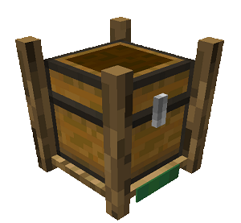
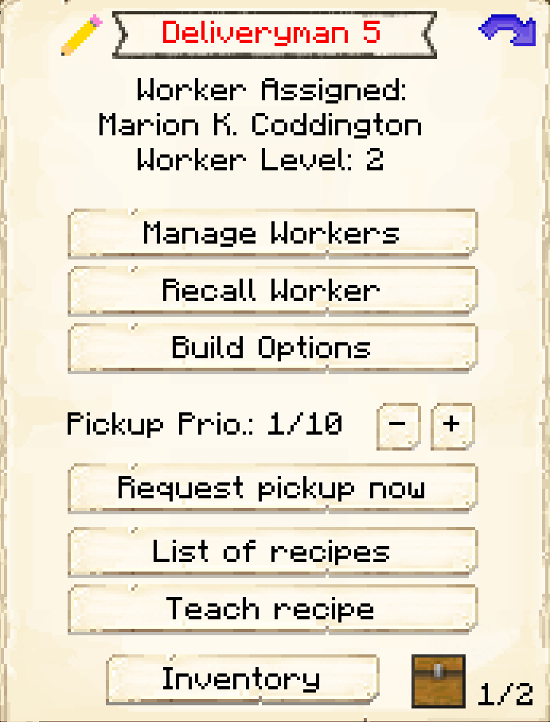
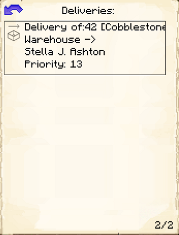

# Courier's Hut

    
    

    

        

        
<strong>Worker:</strong>

        

        

        
<a href="../workers/courier">Courier</a>

        

    

    

    <recipe>deliveryman</recipe>

The Courier runs back and forth from the [Warehouse](../../source/buildings/warehouse) to all the worker huts in your colony, delivering materials to workers and putting finished products in the Warehouse.

**Note:** You *must* build the Warehouse to at least level 1, otherwise, the Courier won't be able to do their job.

The level of the Courier's Hut will dictate how many items/blocks the Courier can carry to/from Huts-Warehouse-Huts, so if you want them to carry more, be sure to upgrade the Courier's Hut. Also, the higher the level of the hut, the faster the Courier will move between huts and the Warehouse.

| Courier's Hut Level | Max Stacks Carried |
| :-----------------: | :----------------: |
| 1                   | 2                  |
| 2                   | 3                  |
| 3                   | 4                  |
| 4                   | 5                  |
| 5                   | unlimited          |

 

## Courier's Hut GUI

When accessing the Courier's Hut block by right-clicking on it, you will see a GUI with different options:

  

    
  

  

     
    <ul>
      
        <li><strong>{{ item.button }}:</strong> {{ item.content }}</li>
      
    </ul>
  

 
 

  

    
  

  

    <ul>
      <li><strong>Deliveries:</strong> This shows a list of all the deliveries the Courier at this hut has. It also shows the priority of each delivery and who requested it.</li> 
    </ul>
  

 
