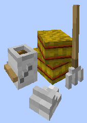
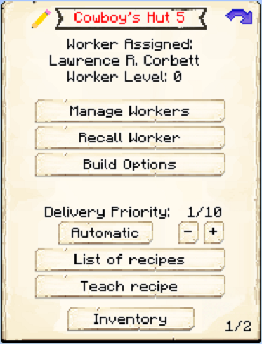

# Cowboy's Hut

    
    

    

        

        
<strong>Worker:</strong>

        

        

        
<a href="../workers/cowboy">Cowboy</a>

        

    

    

    <recipe>cowboy</recipe>

Welcome to the Cowboy Herders' Hut Information Site.

Before you choose a place to build the Cowboy herder's Hut, take into account the location from the Restaurant, Warehouse and/or other Herder(s). After you have selected a place for the hut you have to craft the Cowboy Hut block and place it with the [Building Tool](../items/buildingtool). Once the Cowboy Hut is placed, the Herder will be automatically assigned (or you can manually assign one with the best [Traits](../systems/workerinfo) for a Herder if you changed this in the settings tab in the [Town Hall's GUI](../../source/buildings/townhall).

Now you will have to issue the builder the “Build” assignment so it can build the “Cowboy’s Hut”. Once the builder is done, you will have to capture and bring in 2 Cows the herder's hut. The herder will not catch and bring in any Cows, only breed and butcher the ones in his hut area, so make sure you provide it with 2 initial Cows.

**Note:** The Herder will only keep alive 2 Cows per hut level, so at level 5 they will have 10 animals in their holding pens alive to breed and butcher. This means they will keep *MORE* and have faster production and collection of meats, drops and by products. So:

| Building Level | Cows "Housed" |
| ----- | ----- |
| 1 | 2 |
| 2 | 4 |
| 3 | 6 |
| 4 | 8 |
| 5 | 10 |  

Now you can access the Cowboy's Hut block (right click on it) and you will see a GUI with different options:  

  

    
  

  

    
The Worker assigned and it's Level. (The worker levels up in time by doing it's work. The higher the level the faster and more efficient they will be). And the buttons:

    <ul> 
      
        <li><strong>{{ item.button }}:</strong> {{ item.content }}</li>
      
    </ul>
  

  

The **Cowboy** has a pg.2 in the Hut GUI. With an option:

 

  

    
  

  

       
    
This is "page 2" of the GUI. It shows one  buttons:

    <ul>
      <li><b>Collecting Milk:</b> By default. In this mode you will have to provide the herder as many empty buckets as you like and in return he will milk the cows and give you back buckets of milk along with the meat and drops.</li>
       
      <li><b>Not Collecting Milk::</b> In this mode, the Herder will not be asking or waiting for buckets, it will jsut breed and butcher the cows and will not collect milk.</li>
    </ul>
  

  
  
   
  
### **To see build options please see the [Builder](../../source/workers/builder) Page**  

