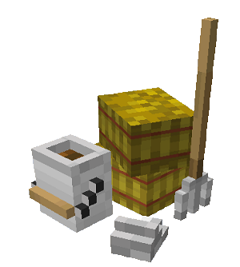
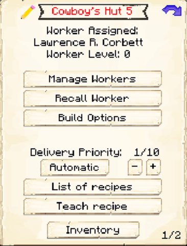
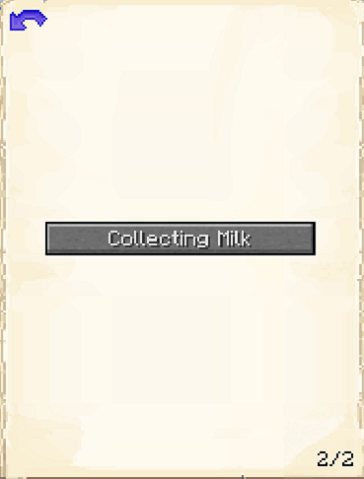

# Cowboy's Hut

    
    

    

        

        
<strong>Worker:</strong> <a href="../workers/cowboy">Cowboy</a>

        

    

    

    

        

        
<strong>Recipe:</strong> 
        

    

    <recipe>cowboy</recipe>
    

# About the Building

The Cowboy Hut is where the Cowboy will raise, breed and butcher cows, for food and leather. You will have to capture and bring in 2 Cows to the herder's hut. The herder will not catch and bring in any Cows.

**Note:** The Herder will only keep alive 2 Cows per hut level, so at level 5 they will have 10 Cows in their holding pens alive to breed and butcher. This means they will keep *MORE* and have faster production and collection of meats, drops and by products. So:

| Building Level | Cows "Housed" |
| ----- | ----- |
| 1 | 2 |
| 2 | 4 |
| 3 | 6 |
| 4 | 8 |
| 5 | 10 |  

# Cowboy Hut GUI

After the building is built, you can access the Cowboy's Hut block (right click on it) and you will see a GUI with different options:

 

  

    
  

  

    
The Worker assigned and it's Level. (The worker levels up in time by doing it's work. The higher the level the faster and more efficient they will be). And the buttons:

    <ul> 
      
        <li><strong>{{ item.button }}:</strong> {{ item.content }}</li>
      
    </ul>
  

 

The **Cowboy** has a pg.2 in the Hut GUI. With an option:

 

  

    
  

  

     
    
This is "page 2" of the GUI. It shows one  buttons:

    <ul>
      <li><b>Collecting Milk:</b> By default. In this mode you will have to provide the herder as many empty buckets as you like and in return he will milk the cows and give you back buckets of milk along with the meat and drops.</li>
       
      <li><b>Not Collecting Milk::</b> In this mode, the Herder will not be asking or waiting for buckets, it will jsut breed and butcher the cows and will not collect milk.</li>
    </ul>
  

  
  
   
  
### **To see build options please see the [Builder](../../source/workers/builder) Page**  

