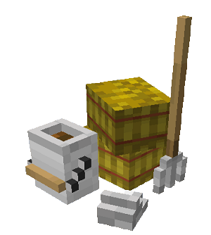
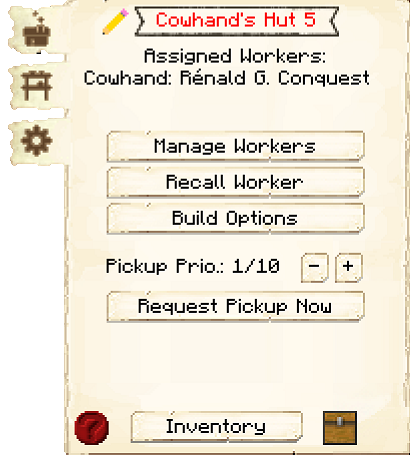
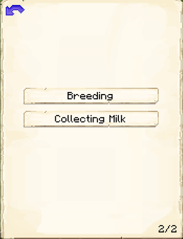

# Cowhand's Hut

    
    

    

        

        
<strong>Worker:</strong>

        

        

        
<a href="../workers/cowhand">Cowhand</a>

        

    

    

    <recipe>cowhand</recipe>

The Cowhand's Hut is where the Cowhand will breed, butcher, and milk (if you have the option enabled) cows for food and leather. You will have to capture and bring in two cows to the Cowhand's Hut, as the Cowhand will not catch and bring in any cows.

**Note:** The Cowhand will only keep two cows alive per hut level, so at level 5 they will have ten cows in their holding pens to breed and butcher. This means they will be faster at producing and collecting meat and leather. So:

| Building Level | Cows Housed |
| ----- | ----- |
| 1 | 2 |
| 2 | 4 |
| 3 | 6 |
| 4 | 8 |
| 5 | 10 |  

## Cowhand's Hut GUI

  

    
    When accessing the Cowhand's Hut block by right-clicking on it, you will see a GUI with different options:

     
    

      

        
      

      

         
        <ul>
          
            <li><strong>{{ item.button }}:</strong> {{ item.content }}</li>
          
        </ul>
      

    

     

     
    

      

        
      

      

         
        
This is page two of the GUI. It has two buttons:

        <ul>
            <li><b>Breeding:</b> On by default. Here you can choose if the Cowhand will breed (and consequently kill) cows or just collect milk (or do nothing, depending on the setting below).</li>
          <li><b>Collecting Milk:</b> On by default. In this mode, you provide the Cowhand with as many empty buckets as you like. In return, they will milk the cows and give you back buckets of milk (along with the meat and leather). You can click the button to turn off this mode, and the Cowhand will only breed and butcher the cows, not milk them.</li>
        </ul>
      

    
  
      
       
  

