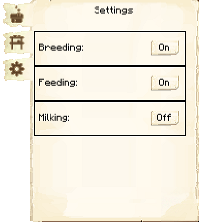

# Cowhand's Hut

    
    

    

        

        
<strong>Worker:</strong>

        

        

        
<a href="../workers/cowhand">Cowhand</a>

        

    

    

    <recipe>cowhand</recipe>

The Cowhand's Hut is where the Cowhand will breed, butcher, and milk (if you have the option enabled) cows for food and leather. You will have to capture and bring in two cows to the Cowhand's Hut, as the Cowhand will not catch and bring in any cows.

**Note:** The Cowhand will only keep two cows alive per hut level, so at level 5 they will have ten cows in their holding pens to breed and butcher. This means they will be faster at producing and collecting meat and leather. So:

| Building Level | Cows Housed |
| ----- | ----- |
| 1 | 2 |
| 2 | 4 |
| 3 | 6 |
| 4 | 8 |
| 5 | 10 |  

## Cowhand's Hut GUI
    
When accessing the Cowhand's Hut block by right-clicking on it, you will see a GUI with different options.   You start on the main tab:

 

  

    
  

  

     
    <ul>
      
        <li><strong>{{ item.button }}:</strong> {{ item.content }}</li>
      
    </ul>
  

 

  

     
  

  

     
    
The second tab of the GUI is <strong>Minimum Stock</strong>. 

    <ul>
      <li><strong> Add: </strong> Use this button to tell the hut to keep a minimum stock on hand. Set items will be displayed above the button.</li>
    </ul>
  

 

  

    
  

  

     
    
The third tab of the GUI is <strong>Settings</strong>. 

    <ul>
       <li><b>Breeding:</b> On by default. Here you can choose if the Cowhand will breed (and consequently kill) cows.</li>
       <li><b>Feeding:</b> On by default. Here you can choose if the Cowhand will feed baby animals, to let them grow up faster.</li>
       <li><b>Milking:</b> Off by default. When on, you provide the Cowhand with as many empty buckets as you like. In return, they will milk the cows and give you back buckets of milk.</li>
    </ul>
  

  
