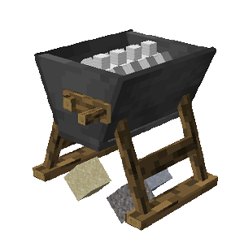
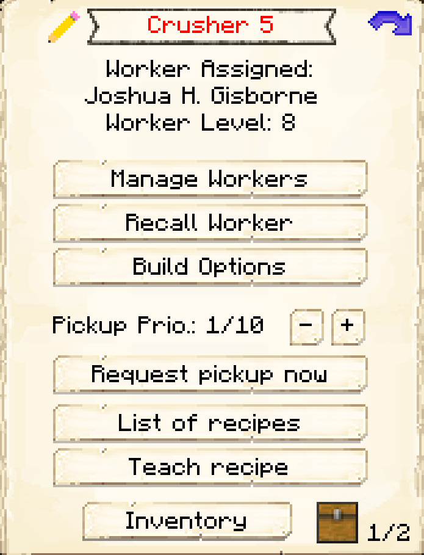
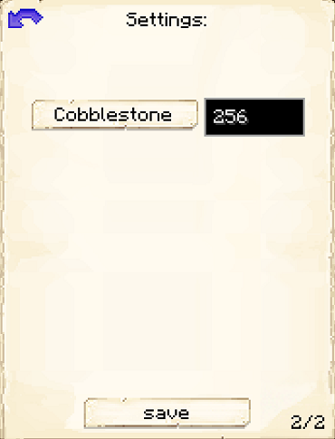

# Crusher

    
    

    

        

        
<strong>Worker:</strong> <a href="../workers/crusher">Crusher</a>

        

    

    

    

        

        
<strong>Recipe:</strong> 
        

    

    <recipe>crusher</recipe>
    

# About the Building

The Crusher Hut is where the Crusher will take items and "crush" them into other blocks according to the configuration but the defaults are: 

| Starting Item | Created Item | Ratio |
| ----- | ----- | ----- |
| Cobblestone   | Gravel       | 2:1   |
| Gravel        | Sand         | 2:1   |
| Sand          | Clay         | 2:1   |

The higher the level of the Hut the more daily output the crusher can handle. So:

| Building Level | Daily Max |
| ----- | ----- |
| 1 | 16  |
| 2 | 64  |
| 3 | 144 |
| 4 | 256 |
| 5 | 999 |

# Crusher Hut GUI

After the building is built, access the Crusher's Hut block (right clicking on it), you will see a GUI with different options:

 

  

    
  

  

    
The Worker assigned and it's Level. (The worker levels up in time by doing it's work. The higher the level the faster and more efficient it will be). And the buttons:

    <ul>
      
        <li><strong>{{ item.button }}:</strong> {{ item.content }}</li>
      
    </ul>
  

On page two of the GUI, you will see what you want the Crusher to Crush and how many per day. (See the above lists). Be sure to click save at the bottom to save any changes made.
 

 
