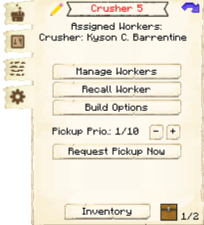

# Crusher's Hut

    
    

    

        

        
<strong>Worker:</strong>

        

        

        
<a href="../workers/crusher">Crusher</a>

        

    

    

    <recipe>crusher</recipe>

# About the Crusher's Hut

The Crusher's Hut is where the Crusher will take items and crush them into other blocks. The defaults are: 

| Starting Item | Created Item | Ratio |
| ----- | ----- | ----- |
| Cobblestone   | Gravel       | 2:1   |
| Gravel        | Sand         | 2:1   |
| Sand          | Clay         | 2:1   |

The higher the level of the Crusher's Hut, the more daily output the Crusher can handle. So:

| Building Level | Daily Max |
| ----- | ----- |
| 1 | 16  |
| 2 | 64  |
| 3 | 144 |
| 4 | 256 |
| 5 | 999 |

# Crusher's Hut GUI

When accessing the Crusher's Hut block by right-clicking on it, you will see a GUI with different options:

 

  

    
  

  

     
    <ul>
      
        <li><strong>{{ item.button }}:</strong> {{ item.content }}</li>
      
    </ul>
  

On page two of the GUI, you can set what you want the Crusher to crush and how many blocks per day. (See the above lists). Be sure to click save at the bottom after you make changes.

 

 
