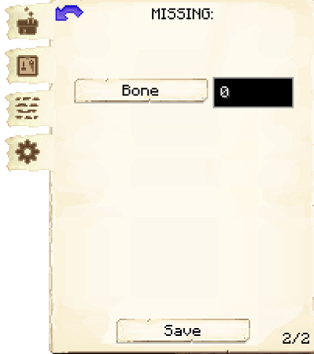

# Crusher

    
    

    

        

        
<strong>Worker:</strong>

        

        

        
<a href="../workers/crusher">Crusher</a>

        

    

    

    <recipe>crusher</recipe>

Welcome to the Crusher Information Site.

Before you choose a place to build the Crusher, take into account the location from Mine, Warehouse and/or other Worker(s). After you have selected a place for the Hut, you have to craft the Crusher's Hut block and place it with your [Building Tool](../items/buildingtool). Once the hut block is placed, the Crusher will be automatically assigned (or you can manually assign one with the best  [Traits](../systems/workerinfo) for Crusher if you changed this in the settings tab in the [Town Hall's GUI](../../source/buildings/townhall).

Now you will have to issue the builder the “Build” assignment so it can build the “Crusher’s Hut”. Once the builder is done you can now hire the Crusher and and select what item you want them to crush. Options for this are setup in the configuration file, but the defaults are: 

| Starting Item | Created Item | Ratio |
| ----- | ----- | ----- |
| Cobblestone   | Gravel       | 2:1   |
| Gravel        | Sand         | 2:1   |
| Sand          | Clay         | 2:1   |

**Hint:** Once the builder is done you will want to upgrade the Crusher to get all the awesome perks it has to offer for higher levels. The higher the level of the Hut the more daily output the crusher can handle. So:

| Building Level | Daily Max |
| ----- | ----- |
| 1 | 16  |
| 2 | 64  |
| 3 | 144 |
| 4 | 256 |
| 5 | 999 |

## Hut GUI

When accessing the Crusher's Hut block (right clicking on it), you will see a GUI with different options:

 

  

    
  

  

    
The Worker assigned and it's Level. (The worker levels up in time by doing it's work. The higher the level the faster and more efficient it will be). And the buttons:

    <ul>
      
        <li><strong>{{ item.button }}:</strong> {{ item.content }}</li>
      
    </ul>
  

  

    
  

  

    
Page 2 of the Gui :

    <ul>
        <li><strong>Item to be crushed:</strong>Amount to crush</li>
    </ul>
  

  
  
   
  
### **To see build options please see the [Builder](../../source/workers/builder) Page**  

