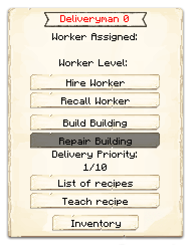

# Deliveryman's Hut

    
    

    

        

        
<strong>Worker:</strong> <a href="../workers/deliveryman">Deliveryman</a>

        

    

    

    

        

        
<strong>Recipe:</strong> 
        

    

    <recipe>deliveryman</recipe>
    

# About the Building

The Deliveryman does exactly what you think they do, it will start to run back and forth from the Warehouse to all the workers huts in your Town. The level of the Deliveryman's Hut will dictate how much materials/tools it will carry to/from Huts - Warehouse - Huts, so if you want it to carry more materials/tools, be sure to upgrade the Deliveryman's Hut.

Also, the higher the level of the hut, the Deliveryman will move faster and faster back and forth (nice leveling perk, right?).

| Building Level | Max Stacks of Materials |
| :------------: | :---------------------: |
| 1              | 1                       |
| 2              | 2                       |
| 3              | 4                       |
| 4              | 5                       |
| 5              | unlimited               |

 

# Deliveryman's Hut GUI

After the building is built, you can access the Deliveryman's Hut block (right click on it) and you will see a GUI with different options:

  

    
  

  

     
    
The Worker assigned and it's Level. (The worker levels up in time by working. The higher the level, the faster and more efficient it will be). And the buttons:

    <ul>
      
        <li><strong>{{ item.button }}:</strong> {{ item.content }}</li>
      
    </ul>
  

**Hint**: You MUST build the [Warehouse](../../source/buildings/warehouse) to at least level 1 so the Deliveryman can do it's work. The deliveryman will visit 1 worker's hut per trip then back to Warehouse. So, level up the Warehouse and build more Deliverymen huts to take care of more worker's huts at the same time and grow grow grow... faster faster faster!
