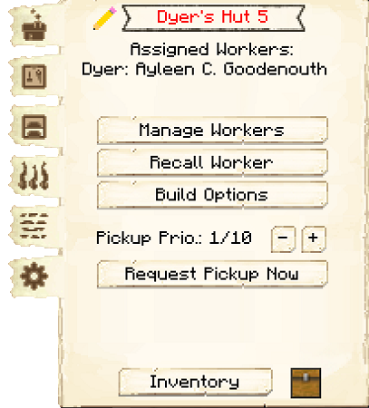
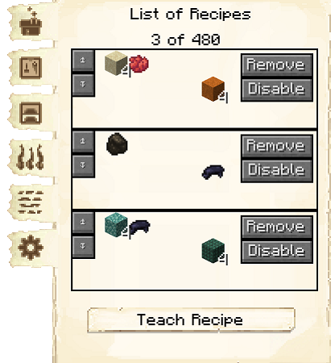
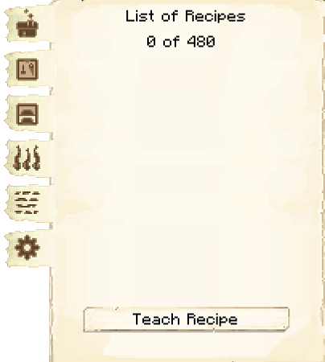
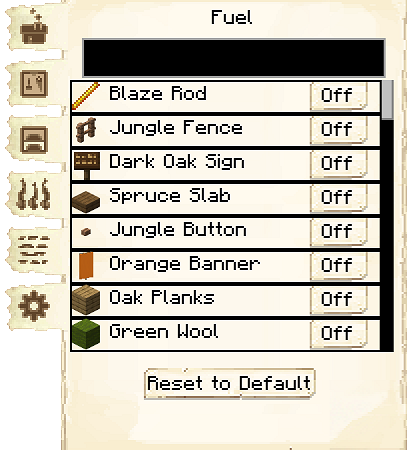
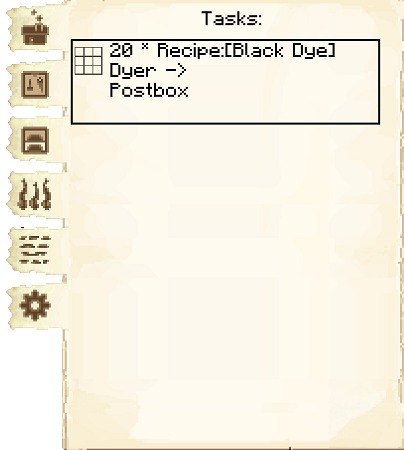
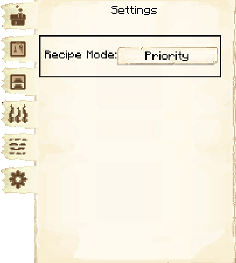

# Dyer's Hut

    
    

    

        

        
<strong>Worker:</strong>

        

        

        
<a href="../workers/dyer">Dyer</a>

        

    

    

    <recipe>dyer</recipe>

### Note: The Dyer cannot be built until you have a level 3 [Flower Shop](../../source/buildings/flowershop) (or three level 1 Flower Shops, or another equivalent) and have finished the research in the [University](../../source/buildings/university).
 

The Dyer's Hut is where the Dyer will craft dyes and dye other items, including red nether bricks and dark prismarine. They won't dye concrete or concrete powder, though. The Dyer will only do this if they receive a request from another worker and have the necessary materials. The Dyer's Hut automatically knows how to make green dye and red sand, but you must teach it the recipes for the other dyes and the dyed items.

**Hint:** The number of recipes you can teach the Dyer's Hut doubles per building level. So:

| Dyer's Hut Level | Number of Recipes |
| :-----: | :-----: |
| 1 | 10 | 
| 2 | 20 |
| 3 | 40 |
| 4 | 80 | 
| 5 | 160 | 

 

**Hint:** The higher the level of the Dyer's Hut, the more furnaces the Dyer will have available. The number of furnaces they *use* depends on their Creativity level. So:

| Dyer's Hut Level |  Furnaces |
| :-----: | :-----: | 
| 1 |  1 |
| 2 |  2 |
| 3 |  3 |
| 4 |  4 |
| 5 |  5 |

**Hint:** The higher the Dyer's Dexterity level, the faster things will smelt. At high levels, they can go *much* faster than the player!

## Dyer's Hut GUI

When accessing the Dyer's Hut block by right-clicking on it, you will see a GUI with different options:

  

    
  

  

     
    <ul>
      
        <li><strong>{{ item.button }}:</strong> {{ item.content }}</li>
      
    </ul>
  

  
 

    

      
    

    

    
The second tab of the GUI is <strong>Crafting Recipes</strong>. Here you can see all the crafting recipes this hut knows.  The arrows allow you to move them up or down in priority.  You are also able to disable specific recipes.

    

  
 

    

      
    

    

    
The third tab of the GUI is <strong>Smelting Recipes</strong>. Here you can see all the smelting recipes this hut knows.  The arrows allow you to move them up or down in priority.  You are also able to remove any recipes you've taught them.

    

  
 

    

      
    

    

    
The fourth tab of the GUI is <strong>Fuel</strong>.  Listed here are items that can be used by the Dyer as fuel in their furnaces. Simply turn on any that you want your Dyer to use, and a <a href="../../source/workers/courier"> Courier</a> will deliver those items to the Dyer when they need fuel.  The black box at the top is to search for items.

    

  
 

    

      
    

    

    
The fifth tab of the GUI is <strong>Tasks</strong>.  This tab shows you any requests the hut is working on, and where it is going.

    

  
 

    

      
    

    

    
The sixth tab of the GUI is <strong>Settings</strong>.

      <li><strong>Recipe Mode:</strong>  This is unlocked by researching Warehouse Master in the University.  This allows you to change the order the hut chooses when it knows more than one recipe for an item. 
        <ul>
          <li><strong>Priority:</strong>  This is the default setting.  The hut will try to use the recipe that is higher up in their recipe list first.</li>
          <li><strong>Warehouse Stock:</strong> The hut will look in the warehouse first to see what resource you have more of before deciding what recipe it will use.</li>
        </ul>
     </li>
    

