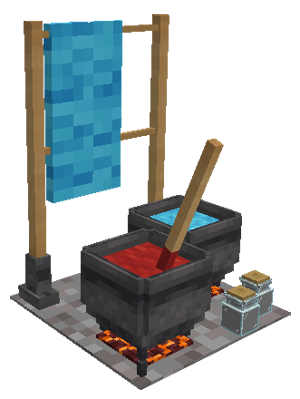
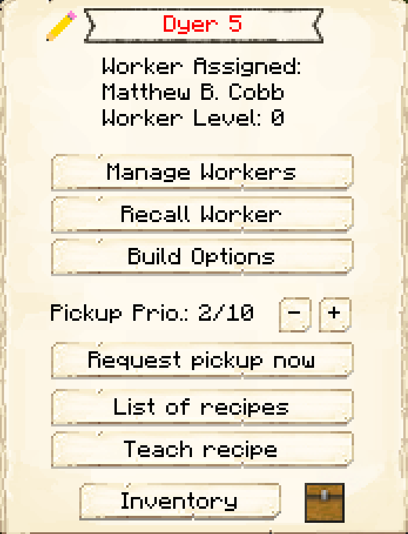

# Dyer's Hut

    
    

    

        

        
<strong>Worker:</strong>

        

        

        
<a href="../workers/dyer">Dyer</a>

        

    

    

    <recipe>dyer</recipe>

# About the Dyer's Hut

The Dyer's Hut is where the Dyer will craft dyes and dye other items (except for concrete). The Dyer will only do this if they receive a request from another worker and have the necessary materials. The Dyer's Hut automatically knows the recipe to make green dye from cactus, but you must teach it the recipes for the other dyes and the dyed items.

**Hint:** The number of recipes you can teach the Dyer's Hut doubles per building level. So:

| Dyer's Hut Level | Number of Recipes |
| :-----: | :-----: |
| 1 | 20 | 
| 2 | 40 |
| 3 | 80 |
| 4 | 160 | 
| 5 | 320 | 

 

# Dyer's Hut GUI

When accessing the Dyer's Hut block by right-clicking on it, you will see a GUI with different options:

  

    
  

  

     
    <ul>
      
        <li><strong>{{ item.button }}:</strong> {{ item.content }}</li>
      
    </ul>
  

 
