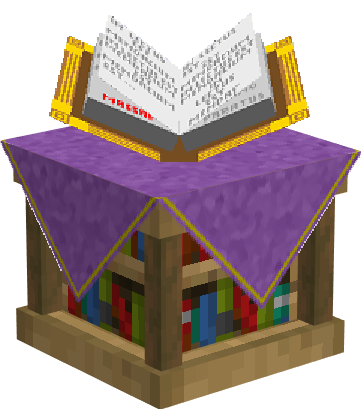
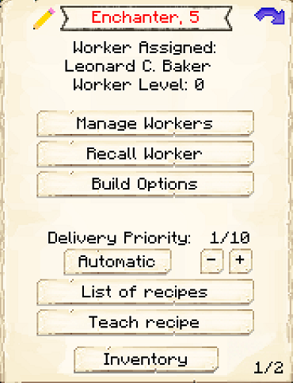
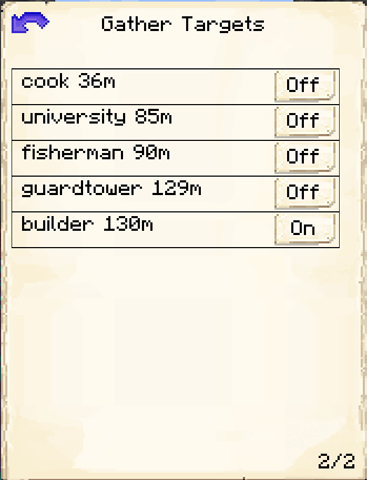

# Enchanter's Tower

    
    

    

        

        
<strong>Worker:</strong>

        

        

        
<a href="../workers/enchanter">Enchanter</a>

        

    

    

    <recipe>enchanter</recipe>

The Enchanter's Tower is where the Enchanter will create enchanted books, as long as they have [Ancient Tomes](../../source/items/ancient_tome). The Enchanter will collect XP from other workers to create the enchanted books. The higher their Mana level, the more XP they will collect per trip. They will *not* apply the enchanted books to tools and armor, you must do that yourself.

The higher the level of the Enchanter's Tower, the higher the level of the enchanted books the Enchanter will produce (the Enchanter's Knowledge level also contributes to this). So:

| Building Level | Enchantment Level | Odds |
| ----- | ----- | ----- |
| 1 | 1 | 50 |
| 2 | 2 | 25 |
| 3 | 3 | 15 |
| 4 | 4 | 5 |
| 5 | 5 | 1 |

The Enchanter can also craft some magical [scrolls](../../source/items/scrolls) upon request:

- The Ultrasafe Colony Teleport Scroll, crafted with 3 paper, a compass, and the <a href="../items/buildtool">build tool</a>. (Outputs 3 scrolls.)
- The Ultrasafe Colony Group Teleport Scroll, crafted with 3 Ultrasafe Colony Teleport Scrolls. The Enchanter's Tower must be at least level 2 for the Enchanter to craft this scroll.
- The Spatial Guard Reinforcements Scroll, crafted with 1 Ultrasafe Colony Teleport Scroll, 5 lapis lazuli, 1 ender pearl, and 1 paper. (Outputs 2 scrolls.) The More Scrolls <a href="../systems/research">research</a> in the <a href="../buildings/university">University</a> must be completed for the Enchanter to craft this scroll.
- The Worker-Where-Are-You Scroll, crafted with 1 Ultrasafe Colony Teleport Scroll, 6 glowstone dust, and 2 paper. (Outputs 5 scrolls.) The More Scrolls research in the University must be completed for the Enchanter to craft this scroll.

## Enchanter's Hut GUI

When accessing the Enchanter's Hut block by right-clicking on it, you will see a GUI with different options:

 

  

    
  

  

     
    <ul>
      
        <li><strong>{{ item.button }}:</strong> {{ item.content }}</li>
      
    </ul>
  

   
On page two of the GUI, you can set which workers the Enchanter will collect XP from.
  
 

Page three has a minimum stock list so you can tell the Enchanter's Tower to keep certain things on hand.
 

