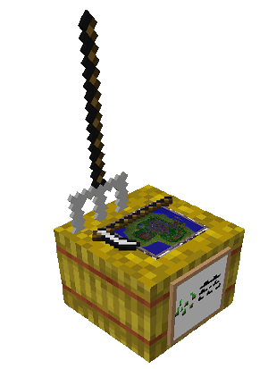
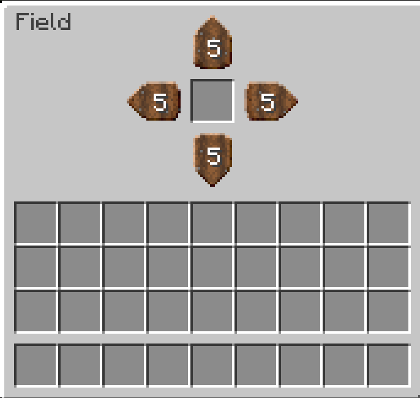
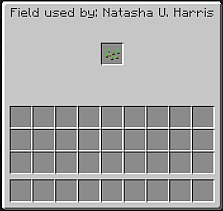
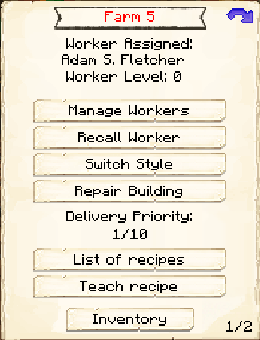
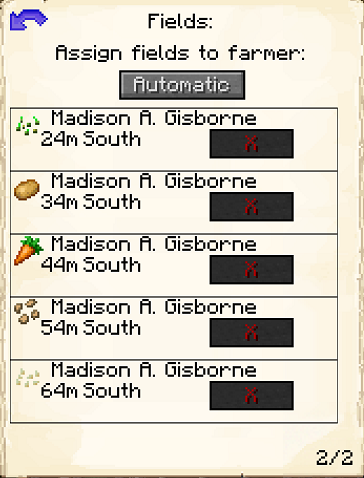
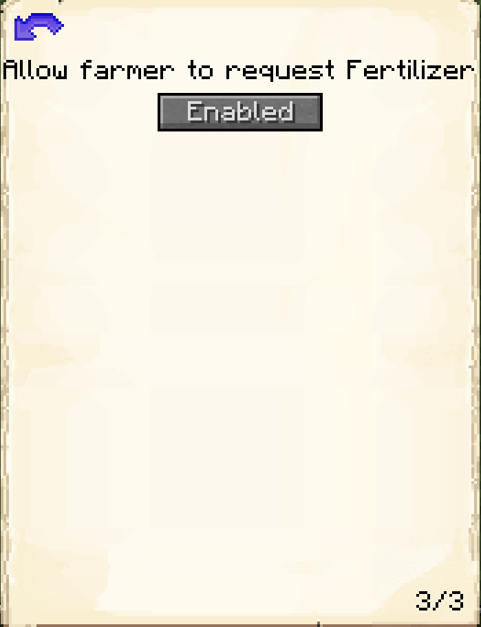

# Farm & Field

    
    

    

        

        
<strong>Worker:</strong>

        

        

        
<a href="../workers/farmer">Farmer</a>

        

    

    

    <recipe>farm</recipe>
     
    <recipe>field</recipe>

The Farm is where the Farmer will grow crops for your colony. The crops the Farmer currently cultivates are wheat, carrots, potatoes, beets, melons, pumpkins, and most crops from other mods (as long as they have normal growth behavior). Before the Farmer can start, you will have to give the Farmer a hoe, an axe (for harvesting crops), and the crop you want to cultivate. 

The Farmer will also craft seeds, carved pumpkins, hay bales, [composted dirt](../../source/items/compost), and coarse dirt. They will only make items when they have been taught the recipes, receive a request for an item, and have the needed materials.

**Note:** The Farmer can only learn a set number of recipes based on their hut level. So:

| Hut Level | Recipes |
| --------- | ------- |
| 1         | 10      |
| 2         | 20      |
| 3         | 40      |
| 4         | 80      |
| 5         | 160     |

For the Farmer to start, you will also need to place fields. Place the Field block (it looks like a scarecrow) in the plot of farmland you want the Farmer to work on and right-click on it to access its GUI. Here you will place the seed of the crop you want this specific field to cultivate. (For potatoes, carrots, and other plants without seeds, just put the raw potato/carrot/etc in the Field.) If you decide later to change the type of crop you want cultivated in that farmland, just go into the Field's GUI and switch the seed there.

 

        

 

You can click on the arrows to change the size of the area the Farmer will farm. The max size is 5 blocks in each direction from the Field block, or 11x11 total.

**IMPORTANT:** The Farmer will farm up to five Fields, depending on the level of the Farm. The level of the Farm is the number of Fields the Farmer can cultivate:

| Farm Level | Fields |
| :-----: |  :-----: | 
| 1 | 1 |
| 2 | 2 |
| 3 | 3 |
| 4 | 4 |
| 5 | 5 |

## Farm GUI

When accessing the Farm block by right-clicking on it, you will see a GUI with different options:

 

  

    
  

  

     
    <ul>
      
        <li><strong>{{ item.button }}:</strong> {{ item.content }}</li>
      
    </ul>
  

  
This is page two of the Farm GUI. It shows the Fields that are available (recognizable by the crop in its GUI and its distance). You can assign them to this Farmer as well.

 

  

    
  

  

     
    <ul>
      <li><b>Automatic/Manual:</b> Automatic by default. Here you can define if you prefer to manually assign the Fields for this Farmer.</li>
      <li><b>Field:</b> This is the list of recognized fields. If the field shows an X, that means it is already assigned to a Farmer and will list the name of the Farmer who takes care of that field. If the X is red and the button is not grayed out, that field belongs to the current Farmer and you can unassign it. If the field has a green check, then that field can be assigned to the Farmer. If the button is grayed out with a check, that means that no one is assigned to that field but the Farmer can not accept any more fields.</li>
    </ul>
  

  
    
  This is page three of the Farm GUI. It lets you choose whether the Farmer will request fertilizer ([compost](../../source/items/compost) or bone meal).

 

  

    
  

  

     

