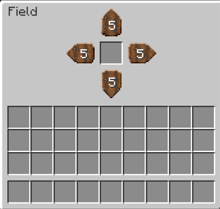
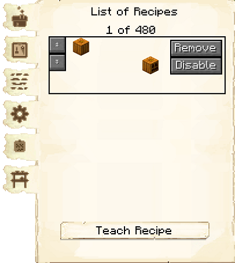

# Farm & Field

    
    

    

        

        
<strong>Worker:</strong>

        

        

        
<a href="../workers/farmer">Farmer</a>

        

    

    

    <recipe>farm</recipe>
     
    <recipe>field</recipe>

# About the Farm & Field

The Farm is where the Farmer will grow crops for your colony. The crops the Farmer currently cultivates are wheat, carrots, potatoes, beets, melons, pumpkins, and most crops from other mods as long as they have normal growth behavior. Before the Farmer can start, you will have to give the Farmer a hoe, an axe (for harvesting crops), and the crop you want to cultivate. 

For the Farmer to start, you will also need to place fields. Place the Field block (it looks like a scarecrow) in the plot of farmland you want the Farmer to work on and right-click on it to access its GUI. Here you will place the crop you want this specific field to cultivate. If you decide later to change the type of crop you want cultivated in that farmland, just go into the Field's GUI and switch the crop there. 

 

        

 

**Note:** The Farmer will only till and cultivate crops that are up to five blocks from the field block. The farmland can be delimited by placing solid blocks (non-tillable: sand, cobblestone, wood, etc) or air blocks in the ground next to the tillable blocks. This will cause the Farmer to stop cultivating the land at this point, even if there is still tilled and/or tillable land after that solid/air block. Plan accordingly and create your plot(s) in any shape and form you want, taking into account that for each field, the Farmer will only work up to 5 blocks from the field block. Remember that for the dirt to be tillable and hold crops, it must have a water source to keep it tilled. Minecraft limits the water source to permeate up to 4 blocks from its placement.

**IMPORTANT:** The Farmer will farm up to five Fields, depending on the level of the Farm. The level of the Farm is the number of Fields the Farmer can cultivate:

| Farm Level | Fields |
| :-----: |  :-----: | 
| 1 | 1 |
| 2 | 2 |
| 3 | 3 |
| 4 | 4 |
| 5 | 5 |

These are just some examples of what a field can be like. You can be creative and make them any shape you like, following the rule of up to five blocks from the Field block and delimited by non tillable blocks.

 

        

 

# Farm GUI

When accessing the Farm block by right-clicking on it, you will see a GUI with different options:

 

  

    
  

  

    
    <ul>
      <li><strong>Farm 5:</strong> This tells you the building you have selected is a Farm with build level 5.</li>
      <li><strong>Worker Assigned:</strong> Tells you the worker assigned to the Farm and their worker level. The worker levels up in time by working. The higher the level, the faster and more efficient they will be.</li>
          <li><strong>Manage Workers:</strong> Lets you change which worker is assigned to be the Farmer. There can only be one Farmer at each Farm. <b>Note:</b> this only works if you have turned the worker hiring mode in the [Town Hall](../../source/buildings/townhall) block to manual, otherwise your citizens will be hired automatically.</li>
      <li><strong>Recall Worker:</strong> Recalls the Farmer to their hut block. You might use it if they are stuck somewhere, you want to see what they have, or want to give them something directly.</li>
      <li><strong>Build Options:</strong> Lets you create a build, upgrade, reposition, or repair build order for the Farm. To learn more about the building system, please visit the [Builder](../../source/workers/builder) page.</li>
      <li><strong>Delivery Priority:</strong> You can set the priority that a [deliveryman](../../source/workers/deliveryman) will visit this hut (ten is the highest, one is the lowest). You can also set whether it is automatic, meaning it changes automatically, or static, meaning it stays to what you set it no matter what.</li>
      <li><strong>List of Recipes and Teach Recipe:</strong> When clicking the list of recipes button, you see all the recipes you have taught this Farm and can remove them. When clicking teach recipe, it opens a 3x3 crafting grid which allows you to teach this hut recipes (not the worker). <b>Note:</b> you don't need to teach the Farm any recipes for the Farmer to do their job.</li>
      <li><strong>Inventory:</strong> Here you can access the hut block's storage, where the Farmer takes their materials and deposits their crops. They will also use any [racks](../../source/decoblocks/rack) or chests in the hut, so be sure to check those as well!</li>
    </ul>
  

  
This is page two of the Farm GUI. It shows the Fields that are available (recognizable by the crop in its GUI and its distance). You can assign them to this Farmer as well.

 

  

    
  

  

     
    <ul>
      <li><b>Automatic/Manual:</b> Automatic by default. Here you can define if you prefer to manually assign the Fields for this Farmer.</li>
      <li><b>Field:</b> This is the list of recognized fields. If the field shows an X, that means it is already assigned to a Farmer and will list the name of the Farmer who takes care of that field. If the X is red and the button is not grayed out, that field belongs to the current Farmer and you can unassign it. If the field has a green check, then that field can be assigned to the Farmer. If the button is grayed out with a check, that means that no one is assigned to that field but the Farmer can not accept any more fields.</li>
    </ul>
  

  
   
  
