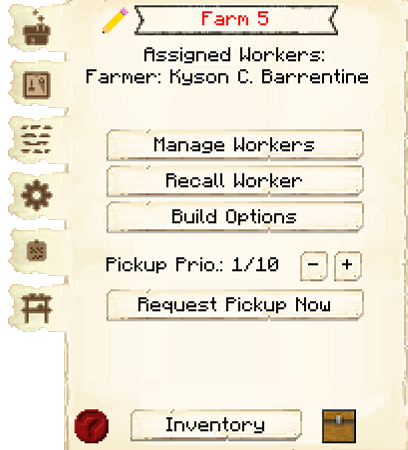

# Farm & Field

    
    

    

        

        
<strong>Worker:</strong>

        

        

        
<a href="../workers/farmer">Farmer</a>

        

    

    

    <recipe>farm</recipe>
     
    <recipe>field</recipe>

# About the Building

The farm is where you grow crops for your colony. The crops the farmer currently cultivates are: Wheat, carrots, potatoes, beets, melons, pumpkins and most "modded" crops (from other mods) as long as they have normal growth behaviour. Before the farmer can start, you will have to give the farmer a hoe, the crop you want to cultivate so the farmer can plant. 

In order to to start, you will also need to place fields. Place the "Field" block in the plot of farm land you want the farmer to work on and right click on it to acces it's GUI. Here you will place the crop you want for this specific field to be cultivated. 

 

        

 

**Note:** The farmer will only till and cultivate crops that are (up to) 5 blocks from the field block. The farm land can be delimited by placing solid blocks (non tillable; sand, cobblestone, wood, etc) or air blocks in the ground next to the tillable blocks. This will cause the farmer to stop cultivating the land at this point, even if there is still tilled and/or tillable land after that solid/air block. Plan accordingly and create your plot(s) any shape and form you want taking into account that for each farm plot, the farmer will only work up to 5 blocks from the field block.

If you decide later to change the type of crop you want cultivated in that specific farm plot, just go into the "Field's" GUI and switch the crop there. Remember that for the dirt to be tillable and hold crops, it must have a water source to keep it tilled and crops stay planted (Minecraft limits the water source to permeate up to 4 blocks from it's placement).

**IMPORTANT:** The farmer will take care of up to 5 "Fields", depending on the level of the "Farmer's Hut". The level of hut is the number of fields it can take care of.

| Hut Level | Fields |
| :-----: |  :-----: | 
| 1 | 1 |
| 2 | 2 |
| 3 | 3 |
| 4 | 4 |
| 5 | 5 |

These are just some examples of what a farm plot can be like. you can be creative and make them any shape you like following the rule of only up to 5 blocks from the "Field" block (Scarecrow) and delimited by non tillable blocks.

 

        

 

# Farmers GUI

Now you can access the Farmer's Hut block (right click on it) and you will see a GUI with different options:

 

  

    
  

  

    
The Worker assigned and it's Level. (The worker levels up in time by doing it's work. The higher the level the faster and more efficient they will be). And the buttons:

    <ul> 
      
        <li><strong>{{ item.button }}:</strong> {{ item.content }}</li>
      
    </ul>
  

  
This is "page 2" of the GUI. It show the "Fields" that are avaialble (recognizable with a "Field" block placed and crop in his GUI) and they can be assigned to this specific farmer.

 

  

    
  

  

     
    
And the buttons:

    <ul>
      <li><b>Automatic/Manual:</b> By default. Here you can define if you prefer to "manually" assign the "Fields" for this farmer.</li>
      <li><b>Field:</b> This is the list of recognized fields. If the field shows an X that means it is already assigned to a farmer and will list the farmers name who takes care of that field, as well as show what seed is in the field "scarecrow". If that X is red and the button is not grayed out, that field belongs to the current farmer and you can unassign it. If the field has a Green check, then that field can be assigned to the farmer. If the button is grayed out, with a check that means that no one is assigned to that field but the current farmer can not accept any more fields. rows, etc.).</li>
    </ul>
  

  
   
  
### **To see build options please see the [Builder](../../source/workers/builder) Page**  
