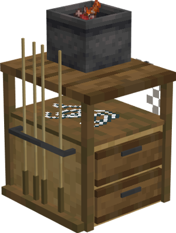

# Fisher's Hut

    
    

    

        

        
<strong>Worker:</strong>

        

        

        
<a href="../workers/fisher">Fisher</a>

        

    

    

    <recipe>fisher</recipe>

The Fisher's Hut is where the Fisher will catch fish. The Fisher requires a fishing rod and a body of water of a minimum of 7 blocks wide x 7 blocks long x 1 block tall to be able to work, and the water must be near his hut.

Upgrading the Fisher's Hut will expand the range at which the Fisher can fish, and the higher the level of the Fisher's Hut, the more loot the Fisher will be fishing out (instead of fish). This includes prismarine and sponges!

## Fisher's Hut GUI

When accessing the Fisher's Hut block by right-clicking on it, you will see a GUI with different options. You start on the main tab:

    

    

    

