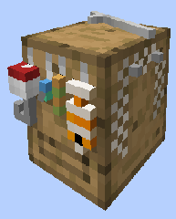

# Fisherman's Hut

    
    

    

        

        
<strong>Worker:</strong>

        

        

        
<a href="../workers/fisherman">Fisherman</a>

        

    

    

    <recipe>fisher</recipe>

Welcome to the Fisherman's Information Site.

Before you choose a place to build his hut, take into account that he has to be near water or that you personally will have to build him a pond close to his hut so he can fish.After you have selected a place for the hut you have to craft the Fisherman's Hut block and place it with your [Building Tool](../items/buildingtool). Once the hut is placed, the Fisherman will be automatically assigned (or you can manually assign one with the best [Traits](../systems/workerinfo) for a fisherman if you changed this in the settings tab in the [Town Hall's GUI](../../source/buildings/townhall).

**Note**: The Fisherman will require a body of water of a minimum of 7 x 7 x 1 block deep for the Fisherman to be able to work. And it must be near his hut.

Once the builder is done, you can think about upgrading the Fisherman's hut to expand the range at which it can fish as well as having a higher cap to the level it can reach.

Now you can access the Fisherman's Hut block (right click on it) and you will see a GUI with different options:

 

  

    

  

    
The Worker assigned and it's Level. (The worker levels up in time by working. The 
higher the level the faster and more efficient it will be). And the buttons:

    <ul>
      
        <li><strong>{{ item.button }}:</strong> {{ item.content }}</li>
      
    </ul>
  

**Hint**: You can give the Fisherman an enchanted fishing rod **_(only when the Hut is level 5)_** and reap the benefits of the treasures he/she will be catching for you. Also, the higher the level of the "Fisherman's Hut" is, the higher the level of "loot" he will be fishing out.
  
   
  
### **To see build options please see the [Builder](../../source/workers/builder) Page**  
