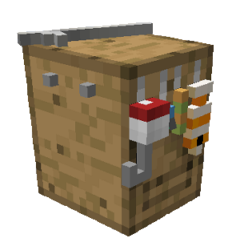
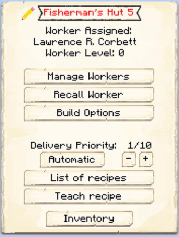

# Fisherman's Hut

    
    

    

        

        
<strong>Worker:</strong>

        

        

        
<a href="../workers/fisherman">Fisherman</a>

        

    

    

    <recipe>fisherman</recipe>

# About the Fisherman's Hut

The Fisherman's Hut is where the Fisherman will catch fish. The Fisherman requires a fishing rod and a body of water of a minimum of 7 x 7 x 1 blocks to be able to work, and the water must be near his hut.

Upgrading the Fisherman's Hut will expand the range at which the Fisherman can fish, and the higher the level of the Fisherman's Hut, the more loot the Fisherman will be fishing out (instead of fish). You can also give the Fisherman an enchanted fishing rod when their hut is level 5 and reap the benefits of the treasures they will be catching for you.

# Fisherman's Hut GUI

When accessing the Fisherman's Hut block by right-clicking on it, you will see a GUI with different options:

 

  

    

  

     
    <ul>
      
        <li><strong>{{ item.button }}:</strong> {{ item.content }}</li>
      
    </ul>
  

 
  
