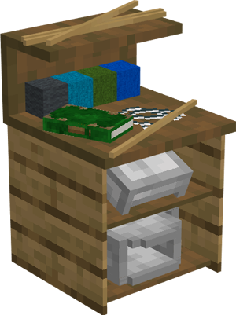

# Fletcher's Hut

    
    

    

        

        
<strong>Worker:</strong>

        

        

        
<a href="../workers/fletcher">Fletcher</a>

        

    

    

    <recipe>fletcher</recipe>

## About the Fletcher's Hut

### Note: The Fletcher can not be built until you have a Level 3 Sawmill and finish the research in the [University](../../source/buildings/university)
 

The Fletcher's Hut is where the Fletcher will craft items that use string or wool, such as bows, fishing poles and paintings. For the Fletcher to work, they must receive a request from another worker and have the necessary materials. The Fletcher's Hut must also have been taught the crafting recipes for all the items you want the Fletcher to be able to craft.

**Hint:** The number of recipes you can teach the Fletcher's Hut doubles per building level. So:

| Fletcher's Hut Level | Number of Recipes |
| :-----: | :-----: |
| 1 | 20 | 
| 2 | 40 |
| 3 | 80 |
| 4 | 160 | 
| 5 | 320 | 

 

## Fletcher's Hut GUI

When accessing the Fletcher's Hut block by right-clicking on it, you will see a GUI with different options:

  

    
  

  

     
    <ul>
      
        <li><strong>{{ item.button }}:</strong> {{ item.content }}</li>
      
    </ul>
  

   
