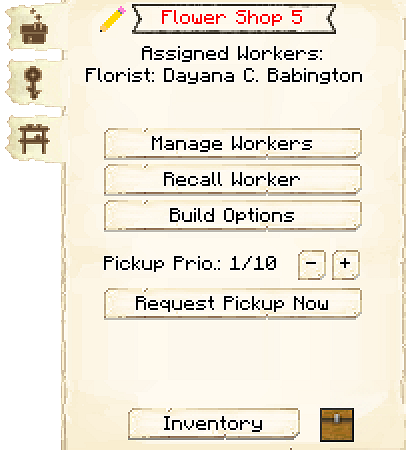
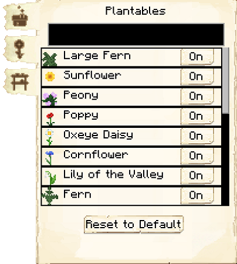

# Flower Shop

    
    

    

        

        
<strong>Worker:</strong>

        

        

        
<a href="../workers/florist">Florist</a>

        

    

    

    <recipe>flowershop</recipe>

# About the Flower Shop

The Flower Shop is where your Florist will grow flowers for your Colony, if given Compost and an axe.

**Hint:** The higher the level of the Flower Shop, the more daily output the florist can handle. So:

| Building Level | Number of Plants |
| ----- | ----- |
| 1 | 4  |
| 2 | 8  |
| 3 | 12 |
| 4 | 16 |
| 5 | 20 |

# Flower Shop GUI

When accessing the Flower Shop's hut block by right-clicking on it, you will see a GUI with different options:

 

  

    
  

  

   
    <ul>
      <li><strong>Florist 5:</strong> This tells you the building you have selected is a Flower Shop with build level 5.</li>
      <li><strong>Worker Assigned:</strong> Tells you the worker assigned to the Flower Shop and their worker level. The worker levels up in time by working. The higher the level, the faster and more efficient they will be.</li>
      <li><strong>Manage Workers:</strong> Lets you change which worker is assigned to be the Florist. There can only be one Florist at each Flower Shop. <b>Note:</b> this only works if you have turned the worker hiring mode in the [Town Hall](../../source/buildings/townhall) block to manual, otherwise your citizens will be hired automatically.</li>
      <li><strong>Recall Worker:</strong> Recalls the Florist to their hut block. You might use it if they are stuck somewhere, you want to see what they have, or want to give them something directly.</li>
      <li><strong>Build Options:</strong> Lets you create a build, upgrade, reposition, or repair build order for the Flower Shop. To learn more about the building system, please visit the [Builder](../../source/workers/builder) page.</li>
      <li><strong>Delivery Priority:</strong> You can set the priority that a [deliveryman](../../source/workers/deliveryman) will deliver requested materials and take flowers to the [warehouse](../../source/buildings/warehouse) (ten is the highest, one is the lowest). You can also set whether it is automatic, meaning it changes automatically, or static, meaning it stays to what you set it no matter what.</li>
      <li><strong>List of Recipes and Teach Recipe:</strong> When clicking the list of recipes button, you see all the recipes you have taught this Flower Shop and can remove them. When clicking teach recipe, it opens a 3x3 crafting grid which allows you to teach this hut recipes (not the worker). <b>Note:</b> you don't need to teach the Flower Shop any recipes for the Florist to do their job.</li>
      <li><strong>Inventory:</strong> Here you can access the hut block's storage, where the Florist takes their materials and deposits their flowers. They will also use any [racks](../../source/decoblocks/rack) or chests in the hut, so be sure to check those as well!</li>
    </ul>
  

 
The second page shows a list of items the Florist can plant. You can turn the plantables on or off. (The black box at the top lets you search for plants.) <b>Note: </b>you can only toggle plantables if the Flower Shop is level four or higher.
  

  

    
  

