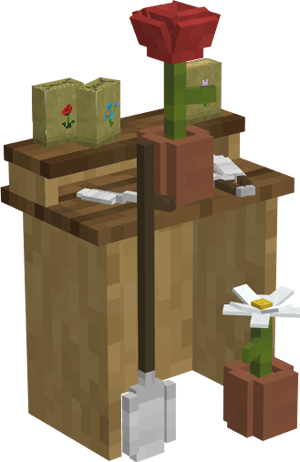

# Flower Shop

    
    

    

        

        
<strong>Worker:</strong>

        

        

        
<a href="../workers/florist">Florist</a>

        

    

    

    <recipe>flowershop</recipe>

## About the Flower Shop

### Note: The Flower Shop can not be built until you have a Level 3 Composter and finish the research in the [University](../../source/buildings/university)
 

The Flower Shop is where your Florist will grow flowers for your Colony, if given Compost and an axe.

**Hint:** The higher the level of the Flower Shop, the more daily output the florist can handle. So:

| Building Level | Number of Plants |
| -------------- | ---------------- |
| 1              | 4                |
| 2              | 8                |
| 3              | 12               |
| 4              | 16               |
| 5              | 20               |

## Flower Shop GUI

When accessing the Flower Shop's hut block by right-clicking on it, you will see a GUI with different options:

 

  

    
  

  

     
    <ul>
      
        <li><strong>{{ item.button }}:</strong> {{ item.content }}</li>
      
    </ul>
  

 
The second page shows a list of items the Florist can plant. You can turn the plantables on or off. (The black box at the top lets you search for plants.) <b>Note: </b>you can only toggle plantables if the Flower Shop is level four or higher.
  

  

    
  

