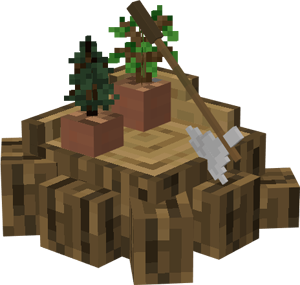
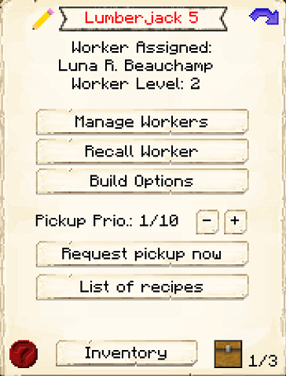
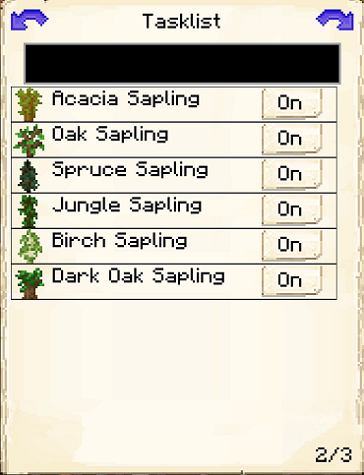
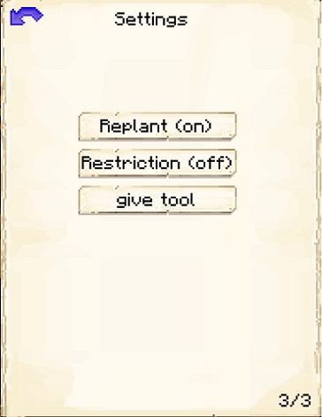

# Forester's Hut

    
    

    

        

        
<strong>Worker:</strong>

        

        

        
<a href="../workers/forester">Forester</a>

        

    

    

    <recipe>forester</recipe>

The Forester's Hut is where the Forester will go in between chopping down trees. The Forester will cut down any tree in an approximate 150 block area (from themselves) that is not in a hut schematic and doesn't have cobblestone placed beneath it.

**Note:** In Minecraft 1.16+ Foresters require hoes (for breaking leaves).

 

## Forester's Hut GUI

When accessing the Forester's Hut block by right-clicking on it, you will see a GUI with different options:

  

    
  

  
 
     
    <ul>
      
        <li><strong>{{ item.button }}:</strong> {{ item.content }}</li>
      
    </ul>
  

  
   

This is page two of the Forester's Hut GUI. It shows a list of recognized saplings the Forester can work with, even modded ones (if coded correctly). Here you can turn on or off which type of trees the Forester will chop down. (The black box at the top is to search for saplings.)

  

    
  

  

    <ul>
      <li><strong>Tasklist:</strong> Where you can select the saplings that you want the Forester to work with. Click on a sapling to turn it on or off.</li> 
    </ul>
  

 
This is page three of the Forester's Hut GUI. 
  

  

    
  

  

    <ul>
      <li><strong>Replant:</strong> Where you can select if you want the Forester to replant trees that are chopped down. They will only do this if they have enough saplings.</li> 
      <li><strong>Restriction:</strong> This lets you turn on or off if you want the Forester to be restricted to a certain area when chopping trees. To choose the area, use the Give Tool button.</li> 
      <li><strong>Give Tool:</strong>This will give you a define area tool so you can select a specific area for the Forester to work. Right click one corner of the area you want, then left click the opposite corner, and this will set a rectangle inside which the Forester will search for trees. Vertical coordinates do not affect this too much; keeping them all around the same y-level can avoid unintentional bugs, though.</li>
    </ul>
  

 
