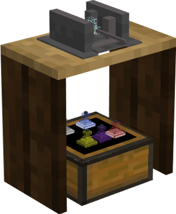

# Glassblower Hut

    
    

    

        

        
<strong>Worker:</strong>

        

        

        
<a href="../workers/glassblower">Glassblower</a>

        

    

    

    <recipe>glassblower</recipe>

# About the Glassblower Hut

The Glassblower Hut is where the Glassblower will smelt sand into glass, and make glass panes from glass blocks. 

**Hint:** The number of recipes you can teach the Glassblower doubles per building level. So:

| Glassblower Level | Number of Recipes |
| :-----: | :-----: |
| 1 | 20 | 
| 2 | 40 |
| 3 | 80 |
| 4 | 160 | 
| 5 | 320 | 

 

# Glassblower GUI

When accessing the Glassblower block by right-clicking on it, you will see a GUI with different options:

  

    
  

  

     
    <ul>
      
        <li><strong>{{ item.button }}:</strong> {{ item.content }}</li>
      
    </ul>
  

   

On page two of the GUI, you will see a list of fuels that you can select that the glassblower will use to fuel the furnace.

 
