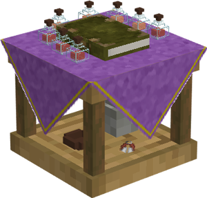

# Hospital

    
    

    

        

        
<strong>Worker:</strong>

        

        

        
<a href="../workers/healer">Healer</a>

        

    

    

    <recipe>hospital</recipe>

### Note: The Hospital cannot be built until you finish the research in the [University](../../source/buildings/university).
 

The Hospital is where injured or sick citizens go. The Healer will heal them with various items. The possible diseases can be changed in the config file, however, these are the defaults:

| Disease | Items Needed to Cure |
| ------- | -------------------- |
| Influenza (the flu) | Carrot and Potato |
| Measles | Dandelion, Kelp, and Poppy |
| Smallpox | Honey Bottle and Golden Apple |

The higher the level of the Hospital, the more people can be healed at a time. So:

| Building Level | Number of Beds |
| ----- | ----- |
| 1 | 1 |
| 2 | 2 |
| 3 | 3 |
| 4 | 4 |
| 5 | 5 |

## Hospital's Hut GUI

When accessing the Hospital's hut block by right-clicking on it, you will see a GUI with different options:

 

  

    
  

  

     
    <ul>
      
        <li><strong>{{ item.button }}:</strong> {{ item.content }}</li>
      
    </ul>
  

 
