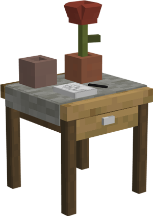
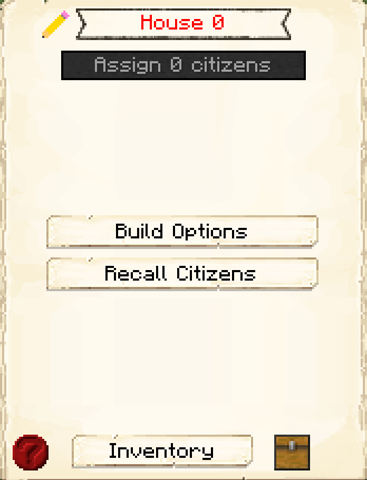

# House

    
    <recipe>house</recipe>

Citizens will go to the House they are assigned to at night to sleep. The House is also a way to get more citizens for your colony.

Each level of the House will house one citizen. So: 

| Building Level | Citizens Housed |
| ----- | ----- |
| 1 | 1 |
| 2 | 2 |
| 3 | 3 |
| 4 | 4 |
| 5 | 5 |

 

For additional citizens to spawn, you first have to have enough space in your House(s) to house your first four citizens. After you have created enough space for your initial four citizens, you have two options for your colony to grow. The first way is to have at least one House at least level 2 that houses an unrelated male and female citizen, which will allow a child to be born in the colony when there is room. You can also make space for a new citizen, go to the [Tavern](../../source/buildings/tavern), wait for a traveler to show up, and then give them the items they request to recruit them.

### Note: To have over 25 citizens, you must first complete the research in the [University](../../source/buildings/university).
 

## House GUI

When accessing the House's hut block by right-clicking on it, you will see a GUI with different options:

 

  

    
  

  

     
    <ul>
      
        <li><strong>{{ item.button }}:</strong> {{ item.content }}</li>
      
    </ul>
  

  
   
  
