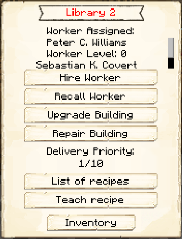

# Library

    
    

    

        

        
<strong>Worker:</strong>

        

        

        
<a href="../workers/librarystudent">Library Student</a>

        

    

    

    <recipe>library</recipe>

### Note: The Library cannot be built until you finish the research in the [University](../../source/buildings/university).
 

The Library is a way for you to raise your adult citizens' Intelligence skill, which influences all other skill increases (at other jobs). A citizen will randomly level up their Intelligence as long as they're assigned to the Library. Being a Library Student is their full-time job, so you can't have one citizen work at the Library and another worker hut at the same time.

Two citizens can study per Library level. So: 

| Building Level | Citizens Educated at a Time |
| -------------- | --------------------------- |
| 1              | 2                           |
| 2              | 4                           |
| 3              | 6                           |
| 4              | 8                           |
| 5              | 10                          |

**Hint:** Paper and books help Library Students increase their skills faster.

 

## Library GUI

When accessing the Library's hut block by right-clicking on it, you will see a GUI with different options:

  

    
  

  

     
    <ul>
      
        <li><strong>{{ item.button }}:</strong> {{ item.content }}</li>
      
    </ul>
  

  
