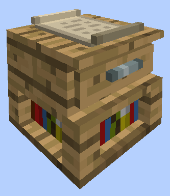
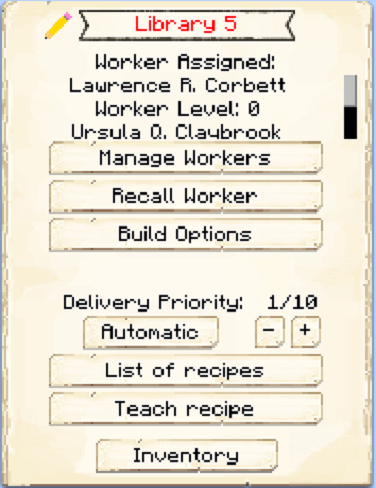
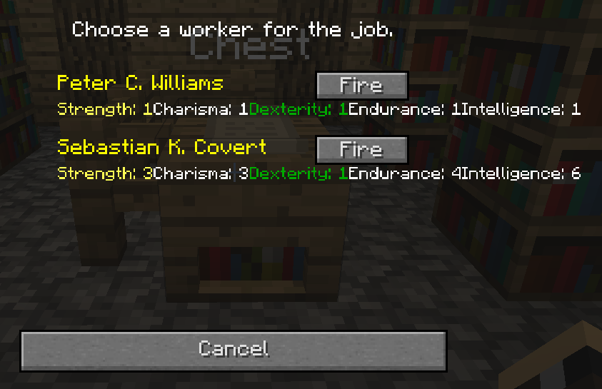
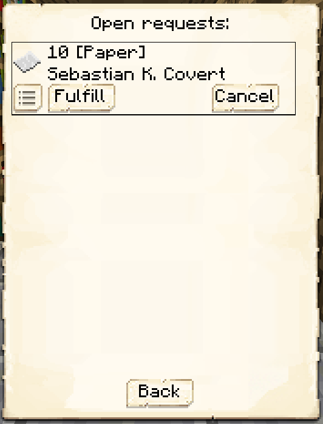

# Library

    
    

    

        

        
<strong>Worker:</strong>

        

        

        
Unemployed Citizens

        

    

    

    <recipe>library</recipe>

The Library is the *ONLY* way for you to raise your Citizen's Skills. When a Citizen Spawns, it will spawn with random skills, but the level of the skills also depend on the [happiness](../systems/happiness) level of the Town. So if the happiness level is low then the new citizens will spawn with low skill stats. In any case, if your citizen's have low skill stats, then it's time to get your citizens educated! For that purpose we have the Library. After you have crafted the Library block, use your [Building Tool](../items/buildingtool) to place the building.

You can aasign Citizens to the library from it's GUI, but only 2 citizens can be assigned per Library level. So we have: 

| Building Level | Citizens "Educated" |
| -------------- | ------------------- |
| 1              | 2                   |
| 2              | 4                   |
| 3              | 6                   |
| 4              | 8                   |
| 5              | 10                  |

  
- **Note:** The Citizen will be *RANDOMLY* leveling up their skills as long as it's assigned to the Library. Once you are satisfied with the level of skills it has reached, you have to *FIRE* it from the Library so it can be unemployed again and you can now *HIRE* it in any other worker hut, guard, etc. Awesome, right?  

## Hut GUI

When accessing the Library's Hut block (right clicking on it) you will see a GUI with different options:  

  

    
  

  

    
 This is the GUI for the Library's Hut. It shows the build "level" of the Hut. And the buttons:

    <ul>
      
        <li><strong>{{ item.button }}:</strong> {{ item.content }}</li>
      
    </ul>
  

  

**Note:** The unemployed citizens will be the only ones available to *HIRE* in the Library. You will only be able to see available citizens to hire if there is room in the Library (according to it's level).  

  

    
  

  

      
    
 So for example, if you have a Library level 1, you can only hire 2 citizens. If it already has 2 citizens assigned, it will only show you those two citizens currently assigned, with the "fire" button and will not list anymore to hire, until there is space availabe.

  

  

**Hint:** As soon as a Citizen is assigned to the Library, you will be able to help it level up faster by giving it *Paper*. Click on a Citizen assigned to the Library, then Click on the *Requests* button and you will be able to give it paper to help level it up faster.  

  

    
  

  

    
  

  
  
   
  
### **To see build options please see the [Builder](../../source/workers/builder) Page**  

