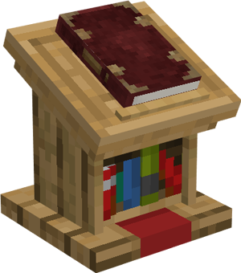

# Library

    
    

    

        

        
<strong>Worker:</strong>

        

        

        
<a href="../workers/librarystudent">Library Student</a>

        

    

    

    <recipe>library</recipe>

## About the Library

The Library is the only way for you to raise your citizens' skills. If your citizens have low-level stats, then it's time to get your citizens educated! For that purpose we have the Library. A citizen will randomly level up their skills as long as they're assigned to the Library. Being a Library Student is their full-time job, so you can't have one citizen work at the Library and another worker hut at the same time.

Two citizens can study at a time per Library level. So: 

| Building Level | Citizens Educated   |
| -------------- | ------------------- |
| 1              | 2                   |
| 2              | 4                   |
| 3              | 6                   |
| 4              | 8                   |
| 5              | 10                  |

**Hint:** Paper helps Library Students increase their skills faster.

 

## Library GUI

When accessing the Library's hut block by right-clicking on it, you will see a GUI with different options:

  

    
  

  

     
    <ul>
      
        <li><strong>{{ item.button }}:</strong> {{ item.content }}</li>
      
    </ul>
  

  
