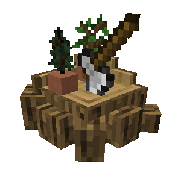
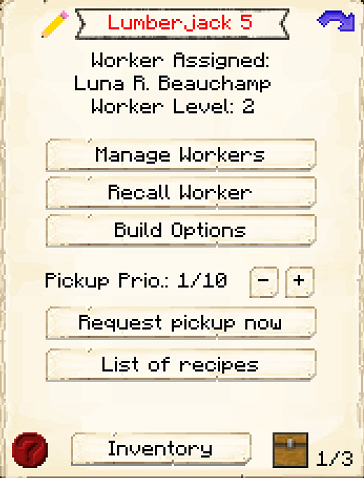
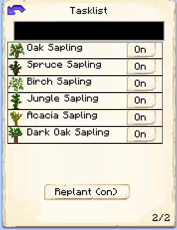
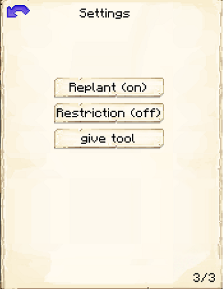

# Lumberjack's Hut

    
    

    

        

        
<strong>Worker:</strong>

        

        

        
<a href="../workers/lumberjack">Lumberjack</a>

        

    

    

    <recipe>lumberjack</recipe>

## About the Lumberjack's Hut

The Lumberjack's Hut is where the Lumberjack will go in between chopping down trees. The Lumberjack will cut down any tree in an approximate 50 block area from their hut that is not in a hut schematic and doesn't have cobblestone placed beneath it.

 

## Lumberjack's Hut GUI

When accessing the Lumberjack's Hut block by right-clicking on it, you will see a GUI with different options:

  

    
  

  
 
     
    <ul>
      
        <li><strong>{{ item.button }}:</strong> {{ item.content }}</li>
      
    </ul>
  

  
   

This is page two of the Lumberjack's Hut GUI. It shows a list of recognized saplings the Lumberjack can work with, even modded ones (if coded correctly). Here you can turn on or off which type of trees the Lumberjack will chop down. (The black box at the top is to search for saplings.)

  

    
  

  

    <ul>
      <li><strong>Tasklist:</strong> Where you can select the saplings that you want the Lumberjack to work with. Click on a sapling to turn it on or off.</li> 
    </ul>
  

 
This is page three of the Lumberjack's Hut GUI. 
  

  

    
  

  

    <ul>
      <li><strong>Replant:</strong> Where you can select if you want the Lumberjack to replant trees that are chopped down. They will only do this if they have enough saplings.</li> 
      <li><strong>Restriction:</strong> This lets you turn on or off if you want the Lumberjack to be restricted to a certain area when chopping trees. To choose the area, use the Give Tool button.</li> 
      <li><strong>Give Tool:</strong>This will give you a define area tool so you can select a specific area for the Lumberjack to work.</li>
    </ul>
  

 
