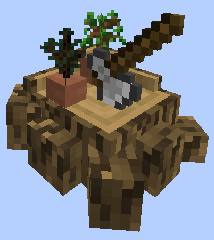
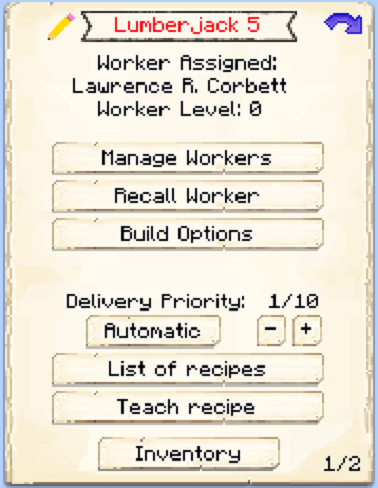

# Lumberjack

    
    

    

        

        
<strong>Worker:</strong>

        

        

        
<a href="../workers/lumberjack">Lumberjack</a>

        

    

    

    <recipe>lumberjack</recipe>

Welcome to the Lumberjack Hut Information Site.

Before you choose a place to build the Lumberjack Hut, take into account the location from Trees, Warehouse and/or other Worker(s). After you have selected a place for the hut you have to craft the Lumberjack Hut block and place it with the [Building Tool](../items/buildingtool). Once the Lumberjack Hut is placed, the lumberjack will be automatically assigned (or you can manually assign one with the best [Traits](../systems/workerinfo) for a Lumberjack if you changed this in the settings tab in the [Town Hall's GUI](../../source/buildings/townhall).

Now you will have to issue the “Build” assignment so it can build the Lumberjack Hut”.

**Note:** Once the Lumberjack block is placed you can go to page 2 of the hut GUI and “define the sapling(s)” you want the Lumberjack to work with. All recognized saplings (even modded items, if coded correctly) will be listed there.  

## Hut GUI

Now you can access the Lumberjack's Hut block (right click on it) and you will see a GUI with different options:

  

    
  

  
 
    
The Worker assigned and their Level. (The worker levels up in time by doing their work. The higher the level the faster and more efficient they will be). And the buttons:

    <ul>
      
        <li><strong>{{ item.button }}:</strong> {{ item.content }}</li>
      
    </ul>
  

  

This is “page 2” of the Lumberjack GUI. It shows a list of recognized saplings it can work with. Here you can turn *ON* or *OFF* which type of trees the Lumberjack will chop down and replant. You can then have 1 lumberjack for 2 types of trees (for example). And the buttons:

  

    
  

  

    <ul>    
      <li><strong>Tasklist</strong> Where you can individually select the saplings (tree types) that you want the Lumberjack to work with.</li>   
      <li><strong>Toggle all: </strong>A button so you can just turn <i>ALL</i> saplings (tree types) "On" or "Off" for easier management.</li>
    </ul>
  

  
  
   
  
### **To see build options please see the [Builder](../../source/workers/builder) Page**  

