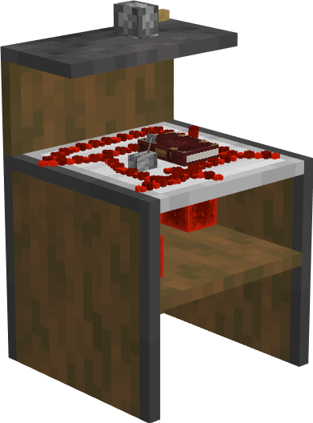

# Mechanic's Hut

    
    

    

        

        
<strong>Worker:</strong>

        

        

        
<a href="../workers/mechanic">Mechanic</a>

        

    

    

    <recipe>mechanic</recipe>

### Note: The Mechanic's Hut cannot be built until you have a level 3 [Blacksmith's Hut](../../source/buildings/blacksmith) (or three level 1 Blacksmith's Huts, or another equivalent) and have finished the research in the [University](../../source/buildings/university).
 

The Mechanic's Hut is where the Mechanic will craft redstone items, rails, minecarts, clocks, compasses, sea lanterns, torches, lanterns, jack-o-lanterns, storage blocks (like blocks of iron, coal, quartz, etc), blue ice, packed ice, enchantment tables, ender chests, tripwire hooks, sticky pistons, anything made with blaze rods, and many other items that no other crafter can make. For the Mechanic to work, they must receive a request from another worker and have the necessary materials. The Mechanic's Hut must also have been taught the crafting recipes for all the items you want the Mechanic to be able to craft.

**Hint:** The number of recipes you can teach the Mechanic's Hut doubles per building level. So:

| Mechanic's Hut Level | Number of Recipes |
| :-----: | :-----: |
| 1 | 20 | 
| 2 | 40 |
| 3 | 80 |
| 4 | 160 | 
| 5 | 320 | 

 

## Mechanic's Hut GUI

When accessing the Mechanic's Hut block by right-clicking on it, you will see a GUI with different options:

  

    
  

  

     
    <ul>
      
        <li><strong>{{ item.button }}:</strong> {{ item.content }}</li>
      
    </ul>
  

   
