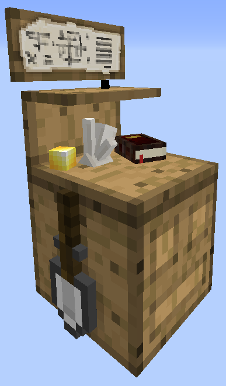
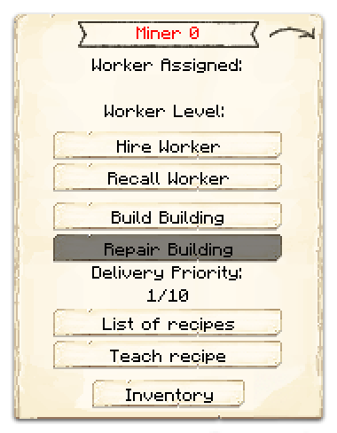
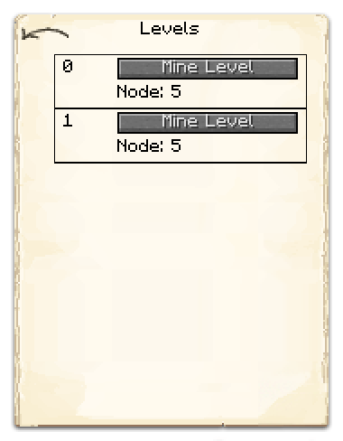

# Mine

    
    

    

        

        
<strong>Worker:</strong>

        

        

        
<a href="../workers/miner">Miner</a>

        

    

    

    <recipe>mine</recipe>

Welcome to the Mine Hut Information Site.

Before you choose a place to build the Mine, take into account the location from Smeltery, Warehouse and/or other Worker(s). After you have selected a place for the hut you have to craft the Mine block and place it with the [Building Tool](../items/buildingtool). Once the Mine Hut is placed, the Miner will be automatically assigned (or you can manually assign one with the best [Traits](../systems/workerinfo) for a Miner if you changed this in the settings tab in the [Town Hall's GUI](../../source/buildings/townhall).

Now you will have to issue the “Build” assignment so it can build the Mine Hut. Once the builder is done you can now hire the Miner.

**Hint:** The shaft the miner creates downwards will go to a specific depth depending on the level of the Mine's Hut. So if you want it to go deeper and get to the good ores, you will have to upgrade the Hut. Level 5 hut will get to Bedrock (if you placed it at Y=64 or above).

## Hut GUI

When accessing the Mine's Hut block (right clicking on it), you will see a GUI with different options:  

  

    
  

  

    
The Worker assigned and it's Level. (The worker levels up in time by doing it's work. The higher the level the faster and more efficient it will be). And the buttons:

    <ul>
      
        <li><strong>{{ item.button }}:</strong> {{ item.content }}</li>
      
    </ul>
  

  

By pressing the arrow button in the top right corner of the GUI, you will be taken to page 2 of the GUI where you will find the following:  

  

    
  

  

    <ul>   
      <li><strong>Mine Level:</strong> The <i>Node</i> refers to the platorms he is placing every 3 blocks down. Here you can assign what "Node" of the mine the miner should be branching out and working in, creating his mineshafts.</li>
    </ul>
  

  
  
   
  
### **To see build options please see the [Builder](../../source/workers/builder) Page**  

