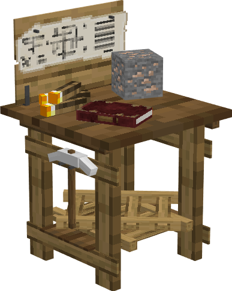

# Mine

    
    

    

        

        
<strong>Worker:</strong> <a href="../workers/miner">Miner</a>

        

    

    

    

        

        
<strong>Recipe:</strong> 
        

    

    <recipe>mine</recipe>

# About the Building

Once the Mine is built, you can hire a miner. 

**Hint:** The shaft the miner creates downwards will go to a specific depth depending on the level of the Mine's Hut. So if you want it to go deeper and get to the good ores, you will have to upgrade the Hut. Level 5 hut will get to Bedrock (if you placed it at Y=64 or above).

## Mine GUI

When accessing the Mine's Hut block (right clicking on it), you will see a GUI with different options:  

  

    
  

  

    
The Worker assigned and it's Level. (The worker levels up in time by doing it's work. The higher the level the faster and more efficient it will be). And the buttons:

    <ul>
      
        <li><strong>{{ item.button }}:</strong> {{ item.content }}</li>
      
    </ul>
  

  

By pressing the arrow button in the top right corner of the GUI, you will be taken to page 2 of the GUI where you will find the following:  

  

    
  

  

    <ul>
      <li><strong>Mine Level:</strong> The <i>Node</i> refers to the platorms he is placing every 3 blocks down. Here you can assign what "Node" of the mine the miner should be branching out and working in, creating his mineshafts.</li> 
      <li><strong>Inventory:</strong> This is the most important button. Here you can access the buildings storage from where the worker takes and deposits materials, tools and anything they find along the way (citizens will pickup anything in their path that is considered a drop; saplings, seeds, rotten flesh, bones, arrows, etc.).</li>
    </ul>
  

  
  
   
  
### **To see build options please see the [Builder](../../source/workers/builder) Page**  

