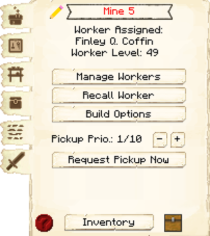

# Mine

    
    

    

        

        
<strong>Worker:</strong>

        

        

        
<a href="../workers/miner">Miner</a>

        

    

    

    <recipe>mine</recipe>

The Mine is where the Miner will mine for ores and materials. Once they are hired, the Miner will create a shaft downward and then branch out.

**Hint:** The shaft the Miner creates downwards will go to a specific depth depending on the level of the Mine:

| Mine Level | Shaft Y Level |
| ---------- | ------------- |
| 1 | 50 |
| 2 | 30 |
| 3+ | Bedrock |

## Mine GUI

  

    
    When accessing the Mine's hut block by right-clicking on it, you will see a GUI with different options:  

    

      

        
      

      

         
        <ul>
          
            <li><strong>{{ item.button }}:</strong> {{ item.content }}</li>
          
        </ul>
      

    
  

    This is page two of the Mine's GUI.  

    

      

        
      

      

        <ul>
          <li><strong>Levels:</strong> The level refers to the platforms the Miner will place every 3 blocks down. Here you can assign what level of the Mine the Miner will create their mineshafts (nodes). If a level has a red number next to it, that means the Miner is currently mining that level. The Miner will ignore orders to mine at a specific level until the entire mineshaft is completed to the maximum depth their hut's level allows.</li> 
        </ul>
      

    
  
      
       
  

