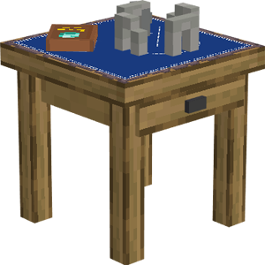

# Mystical Site

    
    

    

        

        
<strong>Worker:</strong>

        

        

        
none

        

    

    

    <recipe>mysticalsite</recipe>

### Note: The Mystical Site cannot be built until you have finished the [research](../../source/systems/research) in the [University](../../source/buildings/university).
 

The Mystical Site is a simple building to increase a colony's overall [happiness](../../source/systems/happinessandsaturation) level. It has no worker, and increases colonists' happiness just by existing.

The [Undertaker](../../source/workers/undertaker) will visit the Mystical Site when there are no colonists to bury. Doing so will increase their Mana skill, and as such, their chance of resurrecting a killed citizen.

## Mystical Site GUI

When accessing the Mystical Site's hut block by right-clicking on it, you will see a GUI with different options:

 

  

    
  

  
  
      <ul>
      <li><strong>Mystical Site Level:</strong> This tells you the type of hut and the build level of the building you have selected.</li>
      <li><strong>Build Options:</strong> Lets you create a build, upgrade, reposition, or repair build order for the Mystical Site. To learn more about the building system, please visit the <a href="../../source/workers/builder">Builder</a> page.</li>
      <li><strong>Inventory:</strong> Here you can access the Mystical Site's storage, where you can store anything you like. No citizen uses it.</li>
      <li><strong>Chest icon:</strong> Click this button to see all the items in the hut's storage (including the hut block's inventory and any racks/chests that came with the hut). Clicking the ? button next to an item's count will highlight the storage container it's in.</li>
    </ul>
  

  
   
