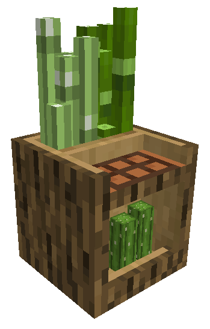
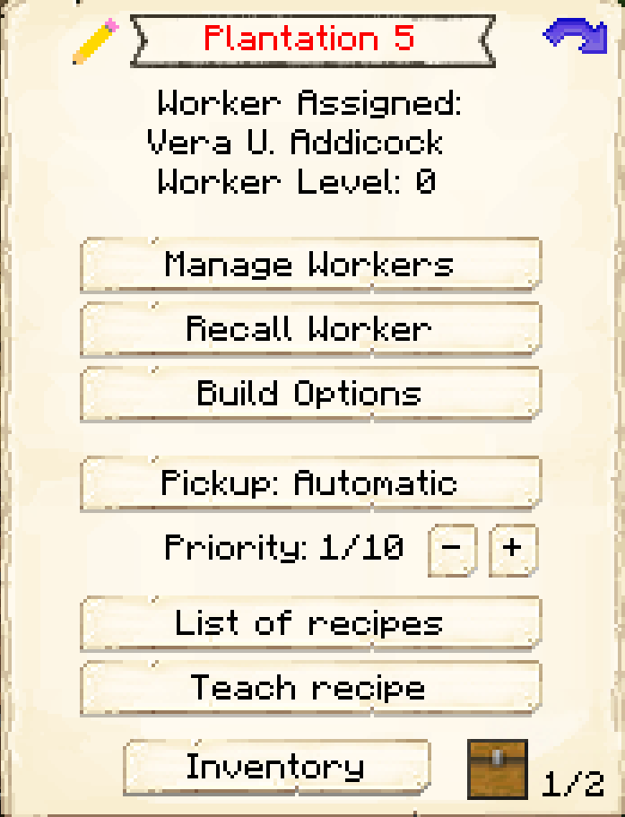
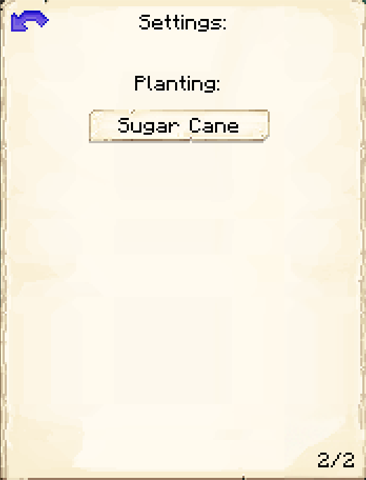

# Plantation

    
    

    

        

        
<strong>Worker:</strong>

        

        

        
<a href="../workers/planter">Planter</a>

        

    

    

    <recipe>plantation</recipe>

## About the Plantation

The Plantation is where the Planter will grow either sugar cane, bamboo, or cactus.

The Plantation's level determines how many crops the Planter can plant at a time.

| Plantation Level | Crops Grown |
| ----- | ----- |
| 1 | 4 |
| 2 | 8 |
| 3 | 12 |
| 4 | 16 |
| 5 | 20 |

 

## Plantation GUI

When accessing the Plantation's hut block by right-clicking on it, you will see a GUI with different options:

  

    
  

  

     
    <ul>
      
        <li><strong>{{ item.button }}:</strong> {{ item.content }}</li>
      
    </ul>
  

   

On page two of the GUI, you can select the plant you want the Planter to grow. Just click the button to cycle through sugar cane, bamboo, or cactus.

 
