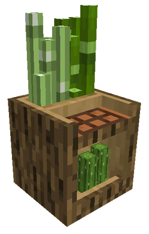

# Plantation Hut

    
    

    

        

        
<strong>Worker:</strong>

        

        

        
<a href="../workers/planter">Planter</a>

        

    

    

    <recipe>plantation</recipe>

# About the Plantation Hut

The Plantation is where the Planter will grow either sugar cane, bamboo, or cactus.

The building level determines how many plots they can plant

| Building Level | Crops Grown |
| ----- | ----- |
| 1 | 4 |
| 2 | 8 |
| 3 | 12 |
| 4 | 16 |
| 5 | 20 |

 

# Plantation GUI

When accessing the Plantation block by right-clicking on it, you will see a GUI with different options:

  

    
  

  

     
    <ul>
      
        <li><strong>{{ item.button }}:</strong> {{ item.content }}</li>
      
    </ul>
  

   

On page two of the GUI, you will see a button to select the item you want the planter to grow.

 
