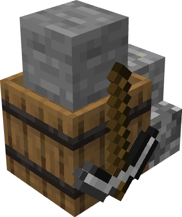

# Quarry

    
    

    

        

        
<strong>Worker:</strong>

        

        

        
<a href="../workers/quarrier">Quarrier</a>

        

    

    

    <recipe>simplequarry</recipe>
     
    <recipe>mediumquarry</recipe>

The Quarry is where you can hire a quarrier to dig the quarry. The Quarry will be a pit of varied size (simple quarry is 1 x 1 chunks, medium is 2 x 2) to collect larger amounts of stone type blocks.

## Quarry GUI

  

    
    When accessing the Quarry's hut block by right-clicking on it, you will see a GUI with different options:  

    

      

        
      

      

         
        <ul>
            <li><strong>Hut Level:</strong>Tells you the type of hut and the build level of the building you have selected.</li>
            <li><strong>Build Options:</strong>Lets you create a build, upgrade, reposition, or repair build order for this hut. To learn more about the building system, please visit the <a href="../../source/workers/builder"> Builder</a> page.</li>
            <li><strong>Inventory:</strong>Here you can access the hut block's storage, where the worker at this hut takes and deposits materials. They will also use any <a href="../../source/items/rack"> racks</a> or chests that were placed in the hut when it was built or upgraded, so be sure to check those as well!</li>
            <li><strong>A chest icon:</strong>Click this button to see all the items in the hut's storage (including the hut block's inventory and any racks/chests that came with the hut). Clicking the ? button next to an item's count will highlight the storage container it's in.</li>
        </ul>
      

    
  

    This is page two of the Quarry's GUI.  

    

      

        
      

      

        <ul>
            <li><strong>Assigned Workers:</strong>Tells you the worker assigned to this building.</li>
            <li><strong>Manage Workers:</strong>Lets you change which worker is assigned to work at this hut. There can only be one worker at each hut. <b>Note:</b> this only works if you have turned the worker hiring mode in the <a href="../../source/buildings/townhall"> Town Hall</a> block to manual, otherwise your citizens will be hired automatically.</li>
            <li><strong>Recall Worker:</strong>Recalls the worker at this building to their hut block. You might use it if they are stuck somewhere, you want to see what they have, or want to give them something directly.</li>           
        </ul>
      

    

     
  

