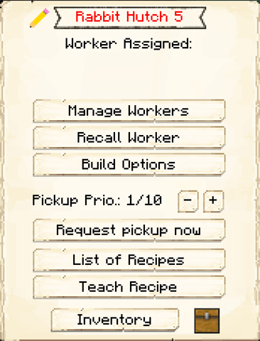

# Rabbit Hutch

    
    

    

        

        
<strong>Worker:</strong>

        

        

        
<a href="../workers/rabbitherder">Rabbit Herder</a>

        

    

    

    <recipe>rabbithutch</recipe>

 The Rabbit Hutch is where the Rabbit Herder will raise and butcher rabbits. You will have to capture and bring in two rabbits to the Rabbit Hutch, as the Rabbit Herder will not catch and bring in any rabbits.

**Note:** The Rabbit Herder will only keep two rabbits alive per hut level, so at level 5 they will have ten rabbits in their holding pens to breed and butcher. This means they will be faster at producing and collecting meat and other drops.

| Building Level | Rabbits Housed |
| ----- | ----- |
| 1 | 2 |
| 2 | 4 |
| 3 | 6 |
| 4 | 8 |
| 5 | 10 |  

## Rabbit Hutch GUI

When accessing the Rabbit Hutch block by right-clicking on it, you will see a GUI with different options:

 

  

    
  

  

     
    <ul>
      
        <li><strong>{{ item.button }}:</strong> {{ item.content }}</li>
      
    </ul>
  

  
   
  
